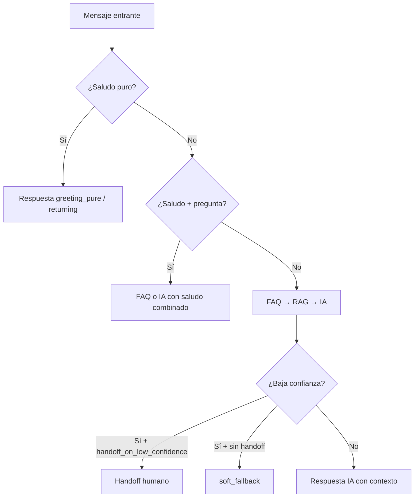

# UI — Configuración de personalidad del bot

## Resumen

Pantalla para que el negocio configure cómo responde el bot en situaciones conversacionales (saludos, gracias, confirmaciones, sin información) y mensajes base del tenant. El backend ya detecta saludos informales (`holiii`, `buenasss`) y saludo+pregunta; esta UI expone esos ajustes de forma amigable.

**Backend listo:** endpoints `GET/PATCH /businesses/:id/bot-personality`. No requiere migración SQL.

---

## Ubicación sugerida en la UI

```
/negocios/:businessId/configuracion/bot
```

Tabs sugeridos:

| Tab | Contenido |
|-----|-----------|
| **Identidad** | Nombre del bot, tono, mensaje de saludo base |
| **Saludos** | Saludos sugeridos por tono + reglas cliente nuevo/frecuente |
| **Respuestas automáticas** | Variantes por situación (N respuestas) |
| **Derivación** | Mensajes de handoff, fallback y toggle de derivación |

---

## API

### Autenticación

Misma que el resto del backend interno: header `x-api-key` (`INTERNAL_API_KEY` / `BOT_API_SECRET`).

### GET `/businesses/:id/bot-personality`

Devuelve toda la configuración editable en un solo objeto (snake_case).

```json
{
  "bot_name": "Sol",
  "bot_tone": "profesional y cercano",
  "greeting_message": "Hola, soy Sol de Panadería Sol.",
  "fallback_message": "No tengo esa información confirmada todavía.",
  "handoff_message": "Déjame revisarlo con un asesor y te respondemos en breve.",
  "out_of_hours_message": "Estamos fuera de horario.",
  "greeting_config": {
    "new_customer_warmth": "neutral",
    "returning_customer_warmth": "warm",
    "returning_min_messages": 3,
    "combine_greeting_with_answers": true
  },
  "tone_greetings": [
    { "text": "Holaaa", "warmth": "warm", "source": "chat", "usage_count": 5 }
  ],
  "conversational_responses": [
    {
      "trigger": "greeting_pure",
      "enabled": true,
      "selection": "by_warmth",
      "variants": [
        { "text": "{saludo} ¿En qué te ayudo?", "warmth": "neutral" },
        { "text": "Holaaa! Cuéntame qué necesitas 😊", "warmth": "warm" }
      ]
    }
  ],
  "handoff_on_low_confidence": false,
  "placeholders": ["{nombre}", "{negocio}", "{bot}", "{saludo}"],
  "triggers": [
    {
      "id": "greeting_pure",
      "label": "Saludo (cliente nuevo)",
      "description": "Cuando el cliente solo saluda: hola, buenas, holiii, etc.",
      "default_selection": "by_warmth"
    }
  ]
}
```

### PATCH `/businesses/:id/bot-personality`

Body parcial (solo enviar lo que cambió). Respuesta: mismo shape que GET.

```json
{
  "greeting_message": "Hola, soy Sol de Panadería Sol.",
  "handoff_on_low_confidence": false,
  "conversational_responses": [
    {
      "trigger": "thanks",
      "enabled": true,
      "selection": "random",
      "variants": [
        { "text": "¡Con gusto {nombre}!" },
        { "text": "Para eso estamos 😊" }
      ]
    }
  ]
}
```

---

## Campos configurables

### 1. Identidad del bot (columnas `TenantConfig`)

| Campo API | UI label sugerido | Descripción |
|-----------|-------------------|-------------|
| `bot_name` | Nombre del bot | Ej. "Sol". Usado en prompts y placeholder `{bot}`. |
| `bot_tone` | Tono | Texto libre: "profesional y cercano", "informal chileno", etc. |
| `greeting_message` | Saludo base | Mensaje por defecto si no hay variantes ni `tone_greetings`. |
| `fallback_message` | Sin información | Cuando no hay contexto y no se deriva a humano. |
| `handoff_message` | Mensaje al derivar | Lo que ve el cliente al pasar a modo humano. |
| `out_of_hours_message` | Fuera de horario | Para lógica futura de horarios (ya existe en DB). |

### 2. Reglas de saludo (`greeting_config` → `configJson.toneGreetingConfig`)

| Campo | UI | Valores | Default |
|-------|-----|---------|---------|
| `new_customer_warmth` | Tono cliente nuevo | `formal` \| `neutral` \| `warm` | `neutral` |
| `returning_customer_warmth` | Tono cliente frecuente | idem | `warm` |
| `returning_min_messages` | Mensajes para ser “frecuente” | 1–100 | `3` |
| `combine_greeting_with_answers` | Combinar saludo con FAQ | toggle | `true` |

**Comportamiento:** si el cliente escribe "Hola, cuánto cuesta X?" y hay FAQ, el bot puede responder `"{saludo} {respuesta_faq}"` en un solo mensaje.

### 3. Saludos sugeridos (`tone_greetings` → `configJson.toneGreetings`)

Lista de saludos reales del negocio (suelen venir del flujo **Importar chat → Aprobar tono**).

| Campo variante | UI |
|----------------|-----|
| `text` | Texto del saludo |
| `warmth` | Formal / Neutral / Cálido |
| `source` | Solo lectura (ej. "chat") |
| `usage_count` | Solo lectura |

El runtime elige un saludo según `warmth` del cliente (nuevo vs frecuente).

### 4. Respuestas automáticas (`conversational_responses`)

Permite **N variantes** por situación. El backend rota o elige según `selection`.

| `trigger` | Cuándo se usa |
|-----------|----------------|
| `greeting_pure` | Solo saludo: hola, buenas, holiii, buenasss |
| `greeting_returning` | Saludo de cliente con historial (usa `{nombre}`) |
| `thanks` | gracias, muchas gracias |
| `ack` | ok, vale, listo, perfecto |
| `soft_fallback` | Sin contexto RAG; evita derivar de inmediato |

| `selection` | Comportamiento |
|-------------|----------------|
| `random` | Aleatorio (opcional `weight` por variante) |
| `round_robin` | Rota por conversación de forma estable |
| `by_warmth` | Elige variante con `warmth` acorde al cliente |

**Placeholders en textos:**

| Placeholder | Origen |
|-------------|--------|
| `{nombre}` | Alias o nombre del cliente |
| `{negocio}` | Nombre del tenant |
| `{bot}` | `bot_name` |
| `{saludo}` | Saludo elegido de `tone_greetings` o `greeting_message` |

**Defaults si no hay variantes configuradas:**

| Trigger | Texto default |
|---------|---------------|
| `greeting_pure` | `{saludo} ¿En qué te puedo ayudar hoy?` |
| `thanks` | `¡Con gusto! Si necesitas algo más, aquí estoy.` |
| `ack` | `Perfecto. Si tienes otra consulta, escríbeme.` |
| `soft_fallback` | `fallback_message` del tenant |

### 5. Derivación (`handoff_on_low_confidence`)

| Valor | Comportamiento |
|-------|----------------|
| `false` (default) | Ante baja confianza RAG → `soft_fallback` o saludo, **no** deriva |
| `true` | Comportamiento anterior: deriva a humano si RAG < umbral |

Mostrar como toggle: **"Derivar a humano cuando no hay información"**.

---

## Comportamiento del bot (referencia para copy de ayuda en UI)



Casos que el backend ya maneja sin config extra:

- `holiii`, `buenasss` → saludo
- `hola estan atendiendo?` → híbrido (no solo saludo)
- Saludo mal detectado + RAG bajo → saludo en vez de handoff

---

## Archivos sugeridos (repo UI)

| Ruta sugerida | Qué hacer |
|---------------|-----------|
| `app/negocios/[id]/configuracion/bot/page.tsx` | Página principal |
| `components/bot-config/bot-identity-form.tsx` | Identidad + mensajes base |
| `components/bot-config/greeting-rules-form.tsx` | `greeting_config` + `tone_greetings` |
| `components/bot-config/conversational-responses-editor.tsx` | Editor por trigger con lista de variantes |
| `components/bot-config/handoff-settings.tsx` | `handoff_on_low_confidence` + mensajes |
| `lib/api/bot-personality.ts` | `getBotPersonality`, `patchBotPersonality` |

---

## Dependencias de deploy

| Componente | Requisito |
|------------|-----------|
| Backend | Rama `staging` con endpoints `bot-personality` (este PR) |
| Supabase / Postgres | Sin migración nueva |
| Vercel UI | Solo consumir API; `BOT_API_SECRET` ya configurado |
| Importar chat | Opcional; alimenta `tone_greetings` automáticamente |

---

## Cómo probar

1. **API directa**
   ```bash
   curl -s -H "x-api-key: $BOT_API_SECRET" \
     https://api.conversai.easycomp.cl/businesses/{id}/bot-personality
   ```

2. **Guardar variante de gracias**
   ```bash
   curl -s -X PATCH -H "Content-Type: application/json" \
     -H "x-api-key: $BOT_API_SECRET" \
     -d '{"conversational_responses":[{"trigger":"thanks","enabled":true,"selection":"random","variants":[{"text":"¡De nada {nombre}!"}]}]}' \
     https://api.conversai.easycomp.cl/businesses/{id}/bot-personality
   ```

3. **WhatsApp E2E**
   - Enviar `holiii` → debe responder saludo (no handoff).
   - Enviar `gracias` → debe usar variante configurada.
   - Enviar `hola estan atendiendo?` → debe intentar responder la pregunta, no solo saludar.

4. **UI (cuando exista)**
   - Editar saludo base → guardar → enviar `hola` por WhatsApp.
   - Agregar 2 variantes en "Gracias" → enviar `gracias` varias veces y ver rotación.

---

## Relación con Importar chat

El flujo existente de análisis de tono sigue siendo válido:

- Al aprobar tono consolidado, el backend escribe `toneGreetings` y `toneGreetingConfig` en `configJson`.
- La nueva pantalla debe **mostrar** esos valores y permitir editarlos sin borrar el trabajo del import.
- No reemplazar el flujo de import; complementarlo con edición manual.

---

## Notas de implementación UI

- Usar `triggers` del GET para renderizar secciones con label y descripción (no hardcodear en front).
- Validar en cliente: máx. 20 variantes por trigger, texto máx. 500 caracteres (igual que Zod del backend).
- Preview en vivo sustituyendo placeholders con datos de ejemplo (`Camila`, nombre del negocio, etc.).
- Si `conversational_responses` está vacío, mostrar los defaults como placeholder/texto de ayuda, no como datos guardados.
