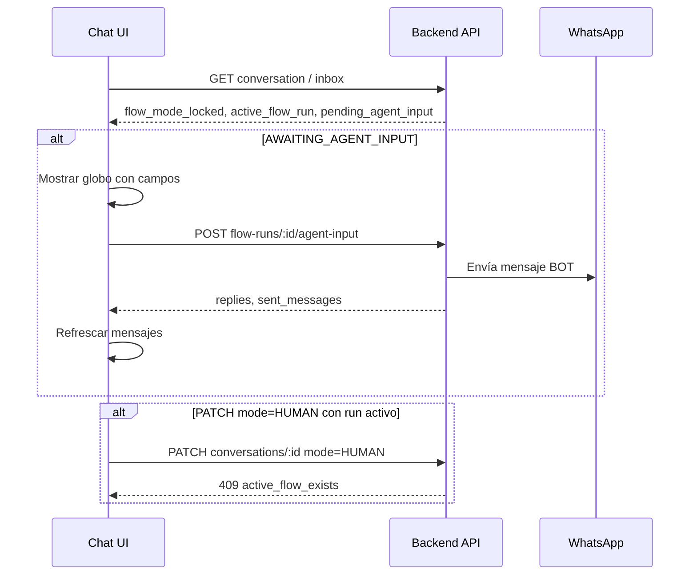

# Módulo Flujos — Especificación UI (MVP)

**Repo UI:** `chat-whatsapp-ai-ui` (no editar desde este agente backend)  
**Contrato API:** [flows-backend-mvp.md](../pending/flows-backend-mvp.md)  
**Spec funcional:** [easycomp-chat-bot-manager_Especificacion_Modulo_Flujos.md](../pending/easycomp-chat-bot-manager_Especificacion_Modulo_Flujos.md)  
**Estado backend:** PR1–PR8 completados  
**Canal MVP:** Solo WhatsApp

---

## Resumen

La UI debe permitir:

1. **Gestionar flujos** (listar, crear desde plantilla, editar borrador, publicar, simular).
2. **Operar flujos en el inbox** (globo de agente, bloqueo modo HUMAN, badge de run activo).
3. **Resolver revisiones** de archivos (logo, etc.) con preview firmado.
4. **Configurar webhook saliente** (`quote.confirmed` → sistema externo).
5. **Monitorear entregas webhook** fallidas y reintentar manualmente.

La conversación **permanece en modo BOT** durante `AWAITING_AGENT_INPUT` y revisiones. El switch BOT/HUMAN se deshabilita si `flow_mode_locked === true`.

---

## Alcance MVP vs posterior

| Incluido en MVP UI | Fuera de MVP UI |
|--------------------|-----------------|
| Listado + CRUD básico de flujos | Editor visual de grafo (React Flow) completo |
| Crear desde plantilla `wood_quote` | Constructor drag-and-drop de nodos |
| Publicar versión borrador | Triggers webhook entrante (solo mostrar URL/secret al publicar) |
| Simulador con mensajes de prueba | Calendario / citas |
| Globo `pending_agent_input` en chat | Chat web como canal |
| Cola de revisiones + resolve | Dashboard analytics de flujos |
| Integración webhook saliente (URL + secret) | Reenvío masivo de deliveries |
| Badge run activo en inbox | Permisos granulares colaborador vs admin |

**Fase recomendada:** primero **inbox + revisiones** (valor operativo inmediato), luego **listado/publicar/simular**, luego **editor de grafo**.

---

## Rutas App Router sugeridas

| Ruta | Pantalla |
|------|----------|
| `/app/flujos` | Listado de flujos (reemplaza placeholder actual) |
| `/app/flujos/nuevo` | Crear flujo (nombre + plantilla) |
| `/app/flujos/[flowId]` | Detalle: versiones, publicar, simular, webhook |
| `/app/flujos/revisiones` | Cola `GET /flow-reviews?status=PENDING` |
| `/app/flujos/integraciones/webhook` | Config `PUT /integrations/flow-webhook` (opcional; puede ser tab en detalle) |

**Inbox (sin ruta nueva):** componentes embebidos en `/app/conversations/[id]`.

---

## Archivos sugeridos (repo UI)

### Capa API

| Archivo | Qué agregar |
|---------|-------------|
| `src/lib/bot-api/types.ts` | Tipos `Flow`, `FlowVersion`, `FlowRun`, `FlowReview`, `FlowWebhookDelivery`, `ActiveFlowRun`, `PendingAgentInput` |
| `src/lib/bot-api/client.ts` | Métodos `botApi.*` (ver tabla endpoints abajo) |
| `src/lib/validators/schemas.ts` | Zod: crear flujo, agent-input, resolve review, webhook integration |
| `src/lib/actions/flow-actions.ts` | Server actions + `revalidatePath` |

### Módulo flujos

| Archivo | Responsabilidad |
|---------|-----------------|
| `src/features/flows/components/flows-page-content.tsx` | Server: lista flujos |
| `src/features/flows/components/flows-manager.tsx` | Tabla, crear, archivar |
| `src/features/flows/components/flow-detail-page-content.tsx` | Versiones, publicar, simular |
| `src/features/flows/components/flow-simulator-panel.tsx` | Chat fake → `POST .../simulate` |
| `src/features/flows/components/flow-webhook-settings.tsx` | URL, eventos, rotar secret |
| `src/features/flows/components/flow-deliveries-table.tsx` | Deliveries + retry |
| `src/features/flows/components/flow-reviews-inbox.tsx` | Lista revisiones + acciones |
| `src/app/app/flujos/page.tsx` | Reemplazar placeholder |
| `src/app/app/flujos/[flowId]/page.tsx` | Detalle |
| `src/app/app/flujos/revisiones/page.tsx` | Cola revisiones |

### Integración inbox (prioridad alta)

| Archivo | Responsabilidad |
|---------|-----------------|
| `src/lib/bot-api/types.ts` | Extender `InboxConversation` con `flow_mode_locked`, `active_flow_run` |
| `src/lib/conversations/load-conversations.ts` | Pasar campos nuevos del inbox API |
| `src/features/conversations/components/flow-run-banner.tsx` | Banner: nombre flujo, estado, nodo actual |
| `src/features/conversations/components/flow-agent-input-bubble.tsx` | Globo sobre composer cuando `pending_agent_input` |
| `src/features/conversations/components/conversation-mode-switch.tsx` | `disabled={flowModeLocked}` + tooltip |
| `src/features/conversations/components/chat-window.tsx` | Montar banner + globo |
| `src/features/conversations/components/contact-details-panel.tsx` | Link a run / revisiones pendientes |

### Referencia de patrones existentes

- CRUD: `src/features/faqs/`, `src/features/despachos/`
- Server page: `src/features/knowledge/components/knowledge-page-content.tsx`
- Menú ya existe: `src/components/layout/app-shell.tsx` → `/app/flujos`

---

## Contrato API → métodos `botApi`

Todas las llamadas usan `X-API-Key: BOT_API_SECRET` (patrón actual en `client.ts`).

### Definiciones

```typescript
// Ejemplos de firmas sugeridas en client.ts
listFlows(businessId: string): Promise<FlowDefinition[]>
createFlow(businessId: string, body: {
  name: string;
  description?: string;
  created_by_admin_id: string;
  template?: "default" | "wood_quote";
}): Promise<FlowDefinition>
getFlow(businessId: string, flowId: string): Promise<FlowDefinition>
patchFlow(businessId: string, flowId: string, body: PatchFlowBody): Promise<FlowDefinition>
deleteFlow(businessId: string, flowId: string): Promise<void>

listFlowVersions(businessId: string, flowId: string): Promise<FlowVersion[]>
createFlowVersion(businessId: string, flowId: string, body: CreateVersionBody): Promise<FlowVersion>
getFlowVersion(businessId: string, flowId: string, versionId: string): Promise<FlowVersion>
updateFlowVersion(businessId: string, flowId: string, versionId: string, body: UpdateVersionBody): Promise<FlowVersion>
publishFlowVersion(businessId: string, flowId: string, versionId: string, body: {
  published_by_admin_id: string;
}): Promise<FlowDefinition>
simulateFlow(businessId: string, flowId: string, body: SimulateBody): Promise<FlowSimulationResult>
```

### Ejecución (desde conversación o panel admin)

```typescript
startConversationFlow(businessId, conversationId, flowId, body?: {
  started_by_admin_id?: string;
  version_id?: string;
}): Promise<FlowRunResult>

getFlowRun(businessId, runId): Promise<FlowRunDetail>
pauseFlowRun / resumeFlowRun / cancelFlowRun / retryFlowRun

submitFlowRunAgentInput(businessId, runId, body: {
  values: Record<string, unknown>;
  submitted_by_admin_id: string;
}): Promise<FlowRunResult & { sent_messages?: SentMessage[] }>
```

### Revisiones y archivos

```typescript
listFlowReviews(businessId, status?: string): Promise<FlowReview[]>
// Cada review puede incluir:
// file?: { id, original_filename, mime_type, signed_url, signed_url_expires_in_seconds }

resolveFlowReview(businessId, reviewId, body: {
  status: "APPROVED" | "REJECTED" | "CHANGES_REQUESTED";
  notes?: string;
  reviewer_admin_id: string;
}): Promise<ResolveReviewResult>

getFlowFileSignedUrl(businessId, fileId, expiresIn?: number): Promise<SignedUrlResponse>
```

### Webhook saliente

```typescript
getFlowWebhookIntegration(businessId): Promise<FlowWebhookIntegration | { configured: false }>
upsertFlowWebhookIntegration(businessId, body: {
  url: string;
  enabled?: boolean;
  events?: string[];
  rotate_secret?: boolean;
}): Promise<FlowWebhookIntegration & { webhook_secret?: string }>

listFlowWebhookDeliveries(businessId, query?: {
  status?: string;
  flow_run_id?: string;
  limit?: number;
}): Promise<FlowWebhookDelivery[]>

retryFlowWebhookDelivery(businessId, deliveryId): Promise<FlowWebhookDelivery>
```

### Conversación (ya existente — extender tipos)

```typescript
// GET /businesses/:id/conversations/:id
type ConversationDetail = Conversation & {
  flow_mode_locked: boolean;
  active_flow_run: {
    id: string;
    status: FlowRunStatus;
    flow_name: string;
    flow_version: number;
    current_node_id: string | null;
    pending_agent_input: PendingAgentInput | null;
  } | null;
};

// GET /businesses/:id/conversations/inbox
type InboxConversation = Conversation & {
  customers: Customer | null;
  last_message_preview?: string | null;
  flow_mode_locked: boolean;
  active_flow_run: {
    id: string;
    status: FlowRunStatus;
    pending_agent_input: PendingAgentInput | null;
  } | null;
};
```

### Tipos clave

```typescript
type FlowRunStatus =
  | "RUNNING"
  | "AWAITING_CUSTOMER"
  | "AWAITING_AGENT_INPUT"
  | "AWAITING_REVIEW"
  | "PAUSED"
  | "COMPLETED"
  | "CANCELLED"
  | "FAILED";

type PendingAgentInput = {
  template: string;
  fields: Array<{
    key: string;
    label: string;
    type: string;
    required?: boolean;
    value?: unknown;
  }>;
  prefilled?: Record<string, unknown>;
};

type FlowWebhookDeliveryStatus =
  | "PENDING"
  | "DELIVERING"
  | "DELIVERED"
  | "FAILED"
  | "DEAD_LETTER";
```

---

## Pantallas — comportamiento UX

### 1. Listado `/app/flujos`

- Tabla: nombre, estado (`DRAFT`/`ACTIVE`/`ARCHIVED`), versión publicada, actualizado.
- Acciones: **Nuevo flujo**, abrir detalle, archivar.
- Crear: modal con nombre + selector plantilla (`wood_quote` recomendado para TWD).
- Requiere `created_by_admin_id` del admin logueado (mismo patrón que FAQs).

### 2. Detalle flujo `/app/flujos/[flowId]`

**Tabs sugeridos:**

| Tab | Contenido |
|-----|-----------|
| Versiones | Lista versiones; botón **Publicar** en borradores; badge `PUBLISHED` |
| Simulador | Panel chat: mensajes role `customer` → ver `next_message`, `captured_fields`, `output_preview` |
| Webhook | Form URL + eventos; mostrar `webhook_secret` **una sola vez** al guardar/rotar |
| Entregas | Tabla `flow-webhook-deliveries`; filtro `FAILED`; botón **Reintentar** |

**Publicar:** confirmación + `published_by_admin_id`. Si el grafo tiene trigger `WEBHOOK`, mostrar aviso de que el secret se genera al sincronizar triggers (republicar para rotar).

### 3. Cola revisiones `/app/flujos/revisiones`

- Lista desde `GET /flow-reviews?status=PENDING`.
- Columnas: conversación/cliente, tipo (`file`), intento, fecha.
- Preview: usar `file.signed_url` si viene en la respuesta; fallback `GET /flow-files/:id/signed-url`.
- Acciones: **Aprobar**, **Rechazar**, **Solicitar cambios** + notas opcionales.
- Al resolver → `POST .../resolve` (el backend envía mensaje WA al cliente).

### 4. Inbox — globo agente (crítico)

**Cuándo mostrar:** `active_flow_run.status === "AWAITING_AGENT_INPUT"` y `pending_agent_input` no es null.

**UI sugerida:**

```
┌─────────────────────────────────────────────┐
│ 🤖 Flujo: Cotización tablas  ·  Paso: envío │
├─────────────────────────────────────────────┤
│ Vista previa del mensaje (template render)  │
│ ┌─────────────────────────────────────────┐ │
│ │ Hola Camila, tu cotización es 276000... │ │
│ └─────────────────────────────────────────┘ │
│ Campos a completar:                         │
│  Total cotización  [ 276000 ]               │
│  Fecha entrega     [ 2026-08-31 ]           │
│                    [ Enviar al cliente ]    │
└─────────────────────────────────────────────┘
```

- **No** cambiar `Conversation.mode` a HUMAN.
- Submit → `POST .../flow-runs/:runId/agent-input` con `values` mapeados por `field.key`.
- Tras éxito: refrescar conversación (Realtime o refetch); el globo desaparece si el flujo avanzó.
- El mensaje aparece en el hilo como **BOT** (no como asesor).

### 5. Inbox — modo conversación bloqueado

- Si `flow_mode_locked === true`:
  - `ConversationModeSwitch` → `disabled={true}`.
  - Tooltip: *"Hay un flujo activo. Solo finaliza o cancela el flujo para pasar a modo humano."*
  - Si el usuario intenta PATCH mode=HUMAN → mostrar toast con error `409` / `active_flow_exists`.

### 6. Inbox — banner run activo

- Mostrar cuando `active_flow_run` existe (cualquier estado no terminal).
- Texto: `{flow_name} · v{flow_version} · {status}`.
- Acciones opcionales MVP: link **Ver ejecución** (`GET flow-runs/:id`), **Cancelar flujo** (confirmación).

### 7. Mensajes con archivo (logo)

- Mensajes inbound `IMAGE`/`DOCUMENT` durante nodo `collect_fields` con `strategy: await_file` los procesa el backend.
- UI: mostrar thumbnail/link si el mensaje tiene media (ver [whatsapp-media-ui.md](./whatsapp-media-ui.md)).

---

## Flujo de datos (inbox)



---

## Dependencias de deploy

| Componente | Requisito |
|------------|-----------|
| **Backend** | Migraciones flujos + webhook deliveries aplicadas |
| **Workers** | `npm run start:workers` (cola `flow-webhook-delivery`) |
| **Supabase Storage** | Bucket `flow-files` (revisiones con preview) |
| **Env UI** | `BOT_API_BASE_URL`, `BOT_API_SECRET` |
| **Env backend** | `SUPABASE_*`, `FLOW_WEBHOOK_MAX_ATTEMPTS`, Redis |
| **Permisos** | CRUD flujos: admin con `role: tenant_admin` en backend |

Orden sugerido de deploy:

1. Backend + migraciones + workers.
2. UI inbox (globo + lock modo).
3. UI revisiones.
4. UI listado/publicar/simular.
5. UI webhook settings + deliveries.

---

## Cómo probar (checklist UI)

### Inbox / globo agente

1. Publicar flujo `wood_quote` y tener conversación WA activa.
2. Iniciar flujo manualmente o con keyword "cotizar".
3. Avanzar hasta nodo `send-quote` → estado `AWAITING_AGENT_INPUT`.
4. Verificar globo con campos `quote.total`, `delivery.requiredDate`.
5. Completar y enviar → mensaje aparece en chat como BOT.
6. Verificar switch HUMAN deshabilitado durante el flujo.

### Revisiones

1. En flujo con logo, enviar imagen por WA.
2. Abrir `/app/flujos/revisiones` → ver item PENDING con preview.
3. Aprobar o solicitar cambios → cliente recibe mensaje WA.

### Webhook saliente

1. En detalle flujo → tab Webhook → guardar URL de prueba (webhook.site o receptor local).
2. Completar flujo hasta `emit_event` / `quote.confirmed`.
3. Verificar entrega en tab Entregas (`DELIVERED`) o con `npm run test:flow-webhook` en backend.
4. Simular fallo (URL inválida) → `FAILED` → botón **Reintentar**.

### Modo bloqueado

1. Con run activo, intentar pasar a HUMAN → switch deshabilitado o toast 409.

---

## Errores API a manejar en UI

| Código HTTP | `code` | UX sugerida |
|-------------|--------|-------------|
| 409 | `active_flow_exists` | Toast: no se puede modo humano con flujo activo |
| 409 | `version_not_draft` | No editar versión publicada |
| 403 | `admin_required` | Ocultar acciones CRUD; solo operación |
| 404 | `flow_not_found` | Redirect a listado |
| 503 | `supabase_not_configured` | Preview archivo no disponible |

---

## Enlaces

- Backend contrato: [flows-backend-mvp.md](../pending/flows-backend-mvp.md)
- Storage archivos: [flows-supabase-storage.md](../pending/flows-supabase-storage.md)
- Script E2E webhook backend: `npm run test:flow-webhook` en `chat-whatsapp-ai`
- Placeholder UI actual: `chat-whatsapp-ai-ui/src/app/app/flujos/page.tsx`
- Menú Flujos ya agregado: `docs/cambios-ui-notas-flujos.md` (repo UI)

---

## Notas para implementación incremental

1. **PR UI-1 (inbox):** tipos inbox + globo + `flow_mode_locked` — desbloquea operación diaria.
2. **PR UI-2 (revisiones):** cola + resolve + signed URL.
3. **PR UI-3 (admin flujos):** listado, crear `wood_quote`, publicar, simular.
4. **PR UI-4 (integraciones):** webhook settings + deliveries + retry.

Cada PR debe incluir actualización de `src/lib/bot-api/types.ts` y prueba manual documentada en `chat-whatsapp-ai-ui/docs/cambios-ui-flujos-*.md`.
