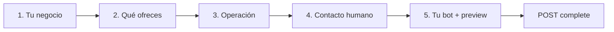

# UI — Wizard de configuración inicial del negocio (onboarding)

## Resumen

Pantalla obligatoria tras crear un negocio para recopilar datos mínimos (qué venden, horario, contacto humano, identidad del bot) antes de activar el asistente de WhatsApp. El backend genera automáticamente FAQs semilla y un documento RAG **Perfil del negocio**.

**Backend listo:** `GET /businesses/:id/setup-status`, `PATCH /businesses/:id/onboarding`, `POST /businesses/:id/onboarding/complete`. Sin migración SQL.

**Relacionado:** [backend-onboarding-setup-wizard.md](../pending/backend-onboarding-setup-wizard.md) (spec técnica backend + Escalation Detector).

---

## Cuándo mostrar el wizard

| Condición | UI |
|-----------|-----|
| `onboarding_required === false` | **No mostrar wizard** (desarrollo / flag desactivado) |
| `onboarding_required === true` y `can_go_live === false` | Redirigir a `/onboarding` o `/negocios/:id/setup` |
| `can_go_live === false` y usuario en dashboard | Banner: *"Completa la configuración ({progress_percent}%)"* |
| `completed_at` con fecha | Ocultar wizard; opcional enlace *"Editar perfil del negocio"* (re-PATCH draft + re-complete) |
| `bot_global_enabled === false` | Badge *"Bot inactivo"* hasta completar |

Tras login/registro que crea negocio (`POST /businesses`), el tenant viene con **`bot_global_enabled: false`**.

---

## Rutas sugeridas

```
/onboarding                    → wizard si hay un solo negocio activo
/negocios/nuevo/setup          → tras crear negocio
/negocios/:businessId/setup    → reanudar wizard
```

---

## API

### Autenticación

```
X-API-Key: <INTERNAL_API_KEY>
```

Base URL: la misma del resto del portal (`BOT_API_URL` / proxy Next).

### GET `/businesses/:id/setup-status`

```json
{
  "setup_version": 1,
  "completed_at": null,
  "progress_percent": 60,
  "can_go_live": false,
  "onboarding_required": true,
  "bot_global_enabled": false,
  "checklist": {
    "identity": { "done": true, "required": true },
    "offerings": { "done": true, "required": true },
    "operations": { "done": false, "required": true },
    "human_contact": { "done": true, "required": true },
    "bot_identity": { "done": true, "required": true },
    "whatsapp_channel": { "done": false, "required": false },
    "knowledge_indexed": { "done": false, "required": false }
  },
  "missing_for_go_live": ["operations"],
  "draft": {
    "identity": { "business_type": "products", "description": "..." },
    "offerings": [{ "type": "product", "name": "...", "description": "...", "price": 1200 }],
    "operations": { "schedule": null, "payment_methods": ["efectivo"] }
  }
}
```

**Notas UI:**
- Si `onboarding_required === false`, ignorar banner/wizard (típico en desarrollo).
- `whatsapp_channel.required` es `false` en staging si el backend tiene `ALLOW_GO_LIVE_WITHOUT_CHANNEL=true`; en producción suele ser requerido.
- `knowledge_indexed` es informativo post-`complete` (indexación async).

### PATCH `/businesses/:id/onboarding`

Body parcial (snake_case). Guardar al avanzar cada paso o al pulsar *Siguiente*.

```json
{
  "identity": {
    "business_type": "products",
    "description": "Panadería artesanal en Santiago con productos horneados todos los días."
  },
  "offerings": [
    {
      "type": "product",
      "name": "Pan amasado",
      "description": "Pan tradicional horneado diario",
      "price": 1200,
      "currency": "CLP"
    }
  ],
  "operations": {
    "schedule": "Lun–Vie 8:00–20:00, Sáb 9:00–14:00",
    "city": "Santiago",
    "commune": "Providencia",
    "address": "Av. Providencia 1234",
    "payment_methods": ["efectivo", "transferencia", "tarjeta"],
    "delivery_notes": "Despacho en RM"
  },
  "human_contact": {
    "admin_name": "María",
    "admin_phone": "+56912345678",
    "notify_on_handoff": true
  },
  "bot_identity": {
    "bot_name": "Sol",
    "bot_tone": "profesional y cercano",
    "greeting_message": "Hola, soy Sol de Panadería Sol."
  }
}
```

**Validaciones frontend (alineadas al backend):**

| Campo | Regla |
|-------|-------|
| `identity.description` | ≥ 50 caracteres |
| `offerings` | ≥ 1 ítem; `description` ≥ 10 chars |
| `operations.schedule` | obligatorio |
| `operations.payment_methods` | ≥ 1 |
| `human_contact.admin_phone` | E.164 |
| `bot_identity.bot_name` | obligatorio |

### POST `/businesses/:id/onboarding/complete`

```json
{
  "enable_bot": true,
  "handoff_on_low_confidence": true
}
```

**200:** activa bot, genera KB/FAQs, encola indexación.

**409:** `{ "error": "onboarding_incomplete", "missing_for_go_live": ["operations"] }`

---

## Wizard — 5 pasos



| Paso | Título | Campos | Acción |
|------|--------|--------|--------|
| 1 | Tu negocio | `business_type` (products / services / both), textarea descripción | `PATCH onboarding` |
| 2 | Qué ofreces | Lista 1–3 ítems: nombre, descripción, precio opcional | `PATCH onboarding` |
| 3 | Operación | Horario, ciudad, comuna, dirección opcional, chips medios de pago, notas despacho | `PATCH onboarding` |
| 4 | Contacto | Nombre admin, teléfono WhatsApp, toggle notificar handoff | `PATCH onboarding` |
| 5 | Tu bot | Nombre bot, tono (select o texto), saludo + **preview** | `PATCH` + `POST complete` |

### Preview paso 5

Mostrar tarjeta simulada:

> **Cliente:** ¿Qué venden?  
> **Bot:** {texto derivado del draft — descripción + lista de offerings}

No requiere llamada extra; se arma en cliente desde `draft`. Opcional: tras `complete`, probar FAQ real con `GET /businesses/:id/faqs`.

### Barra de progreso

Usar `progress_percent` de `setup-status`. Marcar checks según `checklist.*.done`.

---

## Archivos sugeridos (repo UI)

| Ruta | Qué hacer |
|------|-----------|
| `app/onboarding/page.tsx` | Contenedor wizard + stepper |
| `app/negocios/[id]/setup/page.tsx` | Misma UI con `businessId` en URL |
| `components/onboarding/onboarding-stepper.tsx` | Pasos 1–5 |
| `components/onboarding/offering-list-editor.tsx` | Alta/edición ítems |
| `components/onboarding/setup-checklist-banner.tsx` | Banner dashboard incompleto |
| `components/onboarding/bot-preview-card.tsx` | Preview "¿qué venden?" |
| `lib/api/onboarding.ts` | `getSetupStatus`, `patchOnboarding`, `completeOnboarding` |
| `hooks/use-setup-guard.ts` | Redirige si `!can_go_live` y ruta no es setup |

---

## Flujo post-complete

1. Toast: *"¡Tu asistente está listo!"*
2. Redirigir a `/negocios/:id` o inbox
3. Si `whatsapp_channel.done === false`, CTA: *"Conectar WhatsApp"* → flujo Embedded Signup (doc pendiente)
4. `bot_global_enabled` pasa a `true` — el bot ya responde (si hay canal WA)

---

## Inbox — handoff (complemento)

Nuevos motivos en `handoff_reason` del backend:

| Valor | Label sugerido en UI |
|-------|----------------------|
| `customer_frustrated` | Cliente frustrado |
| `repeated_failure` | Bot no pudo resolver tras varios intentos |
| `insufficient_context` | Pregunta sin contexto en KB |

Mostrar en badge/tooltip de conversación derivada.

---

## Dependencias de deploy

| Componente | Requisito |
|------------|-----------|
| Backend | Rama con onboarding + escalation detector |
| Postgres | Sin migración nueva |
| Redis + worker | Indexación KB (`knowledge-index` queue) |
| Vercel UI | `BOT_API_SECRET` / proxy API |
| Staging opcional | `ALLOW_GO_LIVE_WITHOUT_CHANNEL=true` en API |
| Desarrollo | `ONBOARDING_REQUIRED` omitido o `false` → wizard no obligatorio |

---

## Cómo probar (QA UI)

1. `POST /businesses` → verificar `bot_global_enabled: false`.
2. Abrir wizard → completar 5 pasos con PATCH entre pasos.
3. `setup-status` → `progress_percent` sube; `can_go_live: true` al final.
4. Pulsar *Activar asistente* → `POST complete` → 200.
5. `GET /businesses/:id/faqs` → FAQs con `category: onboarding_seed`.
6. WhatsApp (si canal conectado): enviar *"¿qué venden?"* → respuesta con info del draft, no fallback genérico.
7. Enviar *"que mal servicio"* tras una respuesta débil → conversación en modo humano + mensaje empático.

Script backend: `npx tsx scripts/test-onboarding-e2e.ts` (requiere API en `localhost:3000`).
