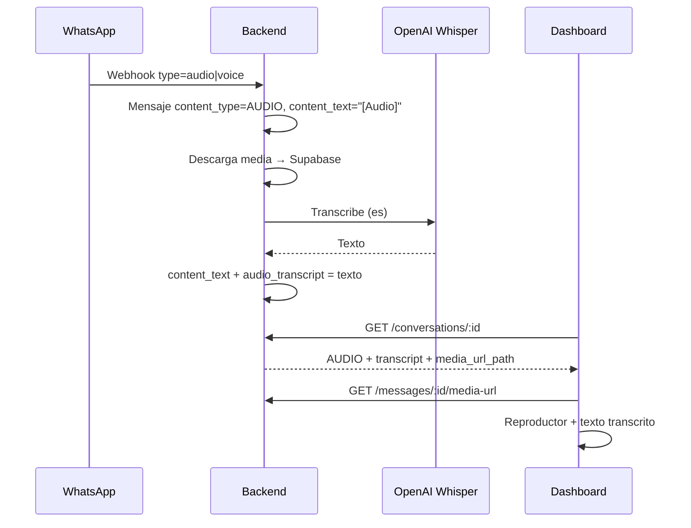

# UI — Audios y notas de voz en el chat de WhatsApp

**Resumen:** El backend recibe notas de voz y audios de WhatsApp, los guarda en `chat-media`, los transcribe con Whisper y permite enviar audio saliente. La UI debe mostrar un reproductor, la transcripción cuando exista, y soportar adjuntar audio en el composer del asesor.

**Repo UI:** `../chat-whatsapp-ai-ui`  
**Backend:** `chat-whatsapp-ai` — commit `be0ea5d`+, migración `20260731130000_message_audio_transcript`  
**Relacionado:** [whatsapp-media-ui.md](./whatsapp-media-ui.md) (imágenes/documentos; mismos endpoints de media-url)

---

## Dependencias de deploy

| Componente | Requisito |
|------------|-----------|
| Backend ECS | Rama `staging` con audio + migración `audioTranscript` |
| `OPENAI_API_KEY` | Necesaria para transcripción Whisper (sin ella: audio se guarda pero `audio_transcript` queda `null`) |
| Bucket `chat-media` | Igual que imágenes/PDF |
| BFF Next.js | Proxy con `x-internal-api-key` (mismo patrón que media existente) |

---

## Qué hace el backend (referencia para la UI)



---

## Modelo de mensaje (campos nuevos / relevantes)

`GET /conversations/:id` → `messages[]`:

```ts
type ChatMessage = {
  id: string;
  content_type: "AUDIO";           // Prisma ContentType.AUDIO
  content_text: string;            // Tras transcribir: el texto; antes: "[Audio]"
  audio_transcript: string | null; // Mismo texto cuando Whisper tuvo éxito; null si falló o pendiente
  media: {
    has_media: boolean;
    mime_type: string | null;      // ej. "audio/ogg", "audio/mpeg"
    filename: string | null;       // ej. "audio.ogg"
    file_size: number | null;
    media_url_path: string | null; // "/messages/:id/media-url"
  };
  // ... resto igual que whatsapp-media-ui.md
};
```

### Reglas de interpretación

| Estado | `content_text` | `audio_transcript` | Qué mostrar |
|--------|----------------|-------------------|-------------|
| Transcripción OK | Texto transcrito | Mismo texto | Reproductor + texto (o solo texto con icono 🎤) |
| Pendiente / falló | `[Audio]` | `null` | Reproductor + “Transcribiendo…” o “Audio sin transcripción” |
| Sin archivo (`has_media: false`) | `[Audio]` | `null` | Placeholder “Audio no disponible” |

**Inbox (`last_message_preview`):** el backend guarda el texto transcrito en `contentText`, así que el preview del inbox puede mostrar el contenido del audio sin cambios extra. Opcional: prefijo `🎤` si `content_type === "AUDIO"`.

**Bot:** usa la transcripción para FAQ/RAG; la UI no necesita lógica especial salvo mostrar la respuesta del bot como siempre.

---

## Endpoints (mismos que media + audio en upload)

### Obtener URL del audio

```
GET /messages/:messageId/media-url?expires_in=3600
```

Misma respuesta que imagen/PDF. Usar `media_url` en `<audio src={url} controls />`.

| `mime_type` típico inbound | Origen |
|----------------------------|--------|
| `audio/ogg` (+ `codecs=opus`) | Nota de voz WhatsApp |
| `audio/mpeg` | Audio adjunto |

### Enviar audio (asesor humano)

```
POST /conversations/:conversationId/messages/media
Content-Type: multipart/form-data
```

| Campo | Notas |
|-------|-------|
| `file` | **Requerido.** OGG, MP3, AAC, AMR, M4A, WEBM |
| `caption` | **No aplica** en WhatsApp para audio (el backend ignora caption en envío WA; puede usarse solo como `content_text` local si se desea) |
| `agent_phone` | Opcional |
| `reply_to_message_id` | Opcional |

**Límites WhatsApp (validar en UI antes de subir):**

| Tipo | MIME aceptados | Tamaño máx. |
|------|----------------|-------------|
| Audio | `audio/ogg`, `audio/mpeg`, `audio/mp4`, `audio/aac`, `audio/amr`, `audio/webm` | **16 MB** |

**Respuesta 201:** `content_type: "AUDIO"`, `audio_transcript: null`, `media.has_media: true`.

### Reenviar audio fallido

```
POST /messages/:messageId/resend
```

Soporta `AUDIO` igual que `IMAGE` / `DOCUMENT`.

---

## Archivos sugeridos (`chat-whatsapp-ai-ui`)

| Ruta | Qué implementar |
|------|-----------------|
| `types/message.ts` | Añadir `audio_transcript?: string \| null` al tipo mensaje |
| `components/chat/chat-audio-player.tsx` | `<audio controls>` + estados loading/error |
| `components/chat/chat-message-bubble.tsx` | Rama `content_type === "AUDIO"` |
| `components/chat/chat-composer.tsx` | Aceptar audio en file picker + validación 16 MB |
| `hooks/use-message-media-url.ts` | Sin cambios (reutilizar para AUDIO) |

---

## Implementación recomendada

### Componente `ChatAudioMessage`

```tsx
// Pseudocódigo
function ChatAudioMessage({ message }: { message: ChatMessage }) {
  const { url, loading, error } = useMessageMediaUrl(message.id, message.media.has_media);

  return (
    <div className="flex flex-col gap-1">
      {message.media.has_media ? (
        <audio controls preload="metadata" src={url} />
      ) : (
        <span className="text-muted">Audio no disponible</span>
      )}
      {message.audio_transcript ? (
        <p className="text-sm">{message.audio_transcript}</p>
      ) : message.content_text !== "[Audio]" ? (
        <p className="text-sm">{message.content_text}</p>
      ) : (
        <p className="text-xs text-muted">Sin transcripción</p>
      )}
    </div>
  );
}
```

### File picker (composer)

Añadir al `accept` del input:

```
audio/ogg,audio/mpeg,audio/mp4,audio/aac,audio/amr,audio/webm,.ogg,.mp3,.m4a
```

Validación cliente:

```ts
const MAX_AUDIO_BYTES = 16 * 1024 * 1024;
if (file.size > MAX_AUDIO_BYTES) {
  toast.error("El audio supera el límite de WhatsApp (16 MB)");
}
```

No mostrar campo caption para archivos de audio (opcional: ocultar caption cuando `file.type.startsWith("audio/")`).

### Evitar el 504 en inbox

El error `504` al cargar inbox suele ser **timeout del BFF/Vercel** (~10 s), no un fallo del audio en sí. Recomendaciones UI:

1. **No bloquear** `fetchConversationsInbox` esperando transcripciones; el mensaje puede llegar primero con `[Audio]` y actualizarse al refrescar o por realtime.
2. Timeout del fetch al backend ≥ 15 s o reintentos con backoff si el backend está desplegando.
3. Si `loadConversationsInbox` falla, mostrar estado degradado (no tumbar toda la página de conversación).
4. Cargar inbox y `flow state` en paralelo sin que uno espere al otro de forma secuencial si no es necesario.

---

## Estados y edge cases

| Caso | UI |
|------|-----|
| Audio recién llegado, transcript aún `null` | Reproductor + skeleton “Transcribiendo…”; refetch mensajes a los 3–5 s o realtime |
| `audio_transcript` y `content_text` iguales | Mostrar una sola vez (evitar duplicar texto) |
| Whisper falló | Solo reproductor + badge “Sin transcripción” |
| `backend_proxy: true` (dev local) | Pasar `media_url` por BFF (igual que imágenes) |
| Safari / iOS | Probar `audio/ogg`; si no reproduce, mostrar enlace “Descargar audio” |
| Mensaje bot responde a audio | Globo bot normal (texto) |

---

## Cómo probar

### 1. Inbound (cliente envía nota de voz)

1. Enviar nota de voz por WhatsApp al número del negocio.
2. Abrir conversación en dashboard.
3. Verificar:
   - `content_type` = `AUDIO`
   - `media.has_media` = `true`
   - Reproductor reproduce el audio
   - `audio_transcript` con texto en español (puede tardar 2–10 s; refrescar si hace falta)

### 2. Outbound (asesor envía audio)

1. Adjuntar un `.ogg` o `.mp3` < 16 MB en el composer.
2. Verificar llegada en WhatsApp del cliente como mensaje de audio.
3. En dashboard: `content_type: "AUDIO"`, reproductor funcional.

### 3. curl

```bash
# Ver mensaje con transcript
curl -s "https://api.conversai.easycomp.cl/conversations/CONV_ID" \
  -H "x-internal-api-key: $KEY" | jq '.messages[] | select(.content_type=="AUDIO")'

# URL del audio
curl -s "https://api.conversai.easycomp.cl/messages/MSG_ID/media-url" \
  -H "x-internal-api-key: $KEY"

# Enviar audio
curl -X POST "https://api.conversai.easycomp.cl/conversations/CONV_ID/messages/media" \
  -H "x-internal-api-key: $KEY" \
  -F "file=@nota.ogg"
```

---

## Referencias backend

| Recurso | Ruta |
|---------|------|
| Mapper webhook audio/voice | `src/modules/channel/whatsapp.mapper.ts` |
| Transcripción Whisper | `src/modules/runtime/audio-transcription.service.ts` |
| Pipeline inbound audio | `src/modules/conversations/inbound-audio.service.ts` |
| Envío WA audio | `src/modules/channel/whatsapp.client.ts` → `sendAudioMessage` |
| Límites MIME audio | `src/modules/conversations/message-media.utils.ts` |
| Serializer (`audio_transcript`) | `src/modules/conversations/message-serializer.ts` |
