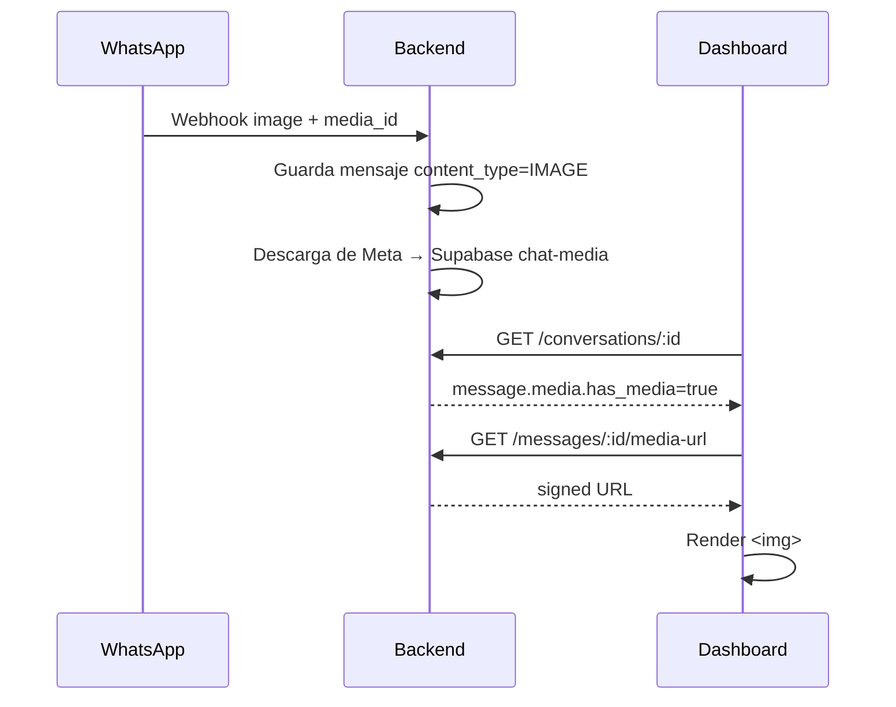
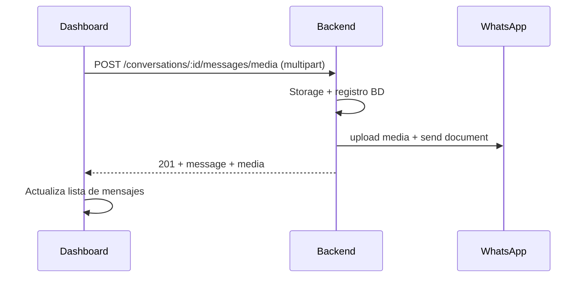

# UI — Imágenes y documentos en el chat de WhatsApp

> **Estado UI:** implementado (ver `docs/cambios-ui-whatsapp-media.md`). Este documento conserva el contrato de referencia.

**Resumen:** El backend ya recibe y envía imágenes (JPEG/PNG) y documentos (PDF, Office, TXT) por WhatsApp. Los archivos se guardan en Supabase (`chat-media`) y la UI debe renderizarlos en los globos del chat, permitir adjuntar al enviar y resolver la URL de preview vía API (nunca acceder a Storage directo).

**Repo UI:** `../chat-whatsapp-ai-ui`  
**Backend:** este repo (`chat-whatsapp-ai`) — ver migración `20260729190000_message_media`.

---

## Dependencias de deploy

| Componente | Estado | Acción UI |
|------------|--------|-----------|
| Backend ECS | Migración `message_media` aplicada | Ninguna |
| Bucket Supabase `chat-media` | Creado (privado, máx. **50 MB**/archivo) | Ninguna |
| Env backend | `SUPABASE_CHAT_MEDIA_BUCKET=chat-media` | Ninguna |
| BFF / API routes UI | Debe proxyar al backend con `x-internal-api-key` | Ver sección API cliente |

> **Límite práctico:** WhatsApp acepta documentos hasta 100 MB, pero el bucket Supabase del proyecto limita a **50 MB**. Validar en el composer antes de subir.

---

## Archivos sugeridos (`chat-whatsapp-ai-ui`)

| Ruta | Qué implementar |
|------|-----------------|
| `types/message.ts` (o equivalente) | Tipos `ContentType`, `MessageMedia`, mensaje serializado |
| `lib/api/messages.ts` | `getMessageMediaUrl`, `sendMediaMessage` |
| `hooks/use-message-media-url.ts` | Cache de URL firmada con TTL |
| `components/chat/chat-message-bubble.tsx` | Render `IMAGE` / `DOCUMENT` / `TEXT` |
| `components/chat/chat-media-preview.tsx` | Imagen inline + tarjeta de documento |
| `components/chat/chat-composer.tsx` | Botón adjuntar, preview local, caption opcional |
| `app/api/.../messages/[id]/media-url/route.ts` (si aplica) | Proxy BFF hacia backend |

---

## Modelo de mensaje (contrato API)

`GET /conversations/:id` devuelve `messages[]` con este shape (campos relevantes):

```ts
type ContentType = "TEXT" | "IMAGE" | "DOCUMENT" | "AUDIO" | "INTERACTIVE";

type MessageMedia = {
  has_media: boolean;
  mime_type: string | null;      // ej. "image/jpeg", "application/pdf"
  filename: string | null;
  file_size: number | null;      // bytes
  media_url_path: string | null; // ej. "/messages/clxyz/media-url" — solo si has_media
};

type ChatMessage = {
  id: string;
  conversation_id: string;
  direction: "INBOUND" | "OUTBOUND";
  sender_type: "CUSTOMER" | "BOT" | "HUMAN" | "SYSTEM";
  content_text: string;          // texto, caption, o placeholder "[Imagen]" / "[Documento]"
  content_type: ContentType;
  external_id: string | null;
  whatsapp_delivery_status: "PENDING" | "SENT" | "DELIVERED" | "READ" | "FAILED" | null;
  reply_to_message_id: string | null;
  quoted_text: string | null;
  quoted_sender_type: string | null;
  created_at: string;
  media: MessageMedia;
};
```

### Reglas de interpretación

| `content_type` | `media.has_media` | Qué mostrar |
|----------------|-------------------|-------------|
| `TEXT` | `false` | Globo de texto habitual |
| `IMAGE` | `true` | Imagen + caption si `content_text` ≠ `"[Imagen]"` |
| `IMAGE` | `false` | Placeholder “Imagen no disponible” (falló descarga backend) |
| `DOCUMENT` | `true` | Tarjeta con icono PDF/doc + `filename` + enlace descarga |
| `DOCUMENT` | `false` | Placeholder con `content_text` o `"[Documento]"` |

---

## Endpoints backend (vía BFF)

Todas las llamadas requieren header `x-internal-api-key` (el BFF de Next.js ya lo usa para el resto del chat).

### 1. Obtener URL de preview / descarga

```
GET /messages/:messageId/media-url?expires_in=3600
```

**Respuesta 200:**

```json
{
  "message_id": "clxyz...",
  "content_type": "IMAGE",
  "mime_type": "image/jpeg",
  "filename": "foto.jpg",
  "file_size": 182344,
  "media_url": "https://pcbwycrgbuioumsopqbe.supabase.co/storage/v1/object/sign/chat-media/...",
  "backend_proxy": false,
  "expires_in_seconds": 3600
}
```

| Campo | Uso en UI |
|-------|-----------|
| `media_url` | `src` de `` o `href` de descarga |
| `backend_proxy` | Si `true` (dev local sin Supabase), `media_url` es ruta relativa `/messages/:id/media/file` → pedirla al BFF con API key, no usar directo en `` |
| `expires_in_seconds` | Renovar URL antes de expirar (cache en hook) |

**Errores:** `404` sin adjunto (`code: "no_media"`).

### 2. Stream de archivo (solo dev / backend_proxy)

```
GET /messages/:messageId/media/file
```

Devuelve bytes con `Content-Type` y `Content-Disposition: inline`. Usar desde BFF si `backend_proxy === true`.

### 3. Enviar imagen o documento (asesor humano)

```
POST /conversations/:conversationId/messages/media
Content-Type: multipart/form-data
```

| Campo form | Tipo | Requerido | Notas |
|------------|------|-----------|-------|
| `file` | File | Sí | JPEG, PNG, PDF, Office, TXT |
| `caption` | string | No | Caption de WhatsApp; si falta, usa nombre de archivo |
| `agent_phone` | string | No | Teléfono del asesor |
| `reply_to_message_id` | string | No | ID interno del mensaje padre |

**Respuesta 201:** mismo shape que mensaje de texto + `content_type` + `media`:

```json
{
  "id": "clxyz...",
  "conversation_id": "...",
  "direction": "OUTBOUND",
  "sender_type": "HUMAN",
  "content_text": "Cotización adjunta",
  "content_type": "DOCUMENT",
  "external_id": "wamid....",
  "whatsapp_delivery_status": "SENT",
  "created_at": "2026-07-29T20:00:00.000Z",
  "media": {
    "has_media": true,
    "mime_type": "application/pdf",
    "filename": "cotizacion.pdf",
    "file_size": 245000,
    "media_url_path": "/messages/clxyz/media-url"
  }
}
```

**Errores comunes:**

| HTTP | Mensaje | Acción UI |
|------|---------|-----------|
| `400` | Tipo no soportado / tamaño excedido | Toast antes de enviar (validación cliente) |
| `502` / `503` | Error WhatsApp / token expirado | Mostrar `error` + `action` si viene |

### 4. Reenviar mensaje fallido

```
POST /messages/:messageId/resend
```

Funciona para `TEXT`, `IMAGE` y `DOCUMENT` (sin cambios en la UI salvo no limitar reenvío solo a texto).

### 5. Enviar texto (sin cambios)

```
POST /conversations/:conversationId/messages
{ "text": "...", "reply_to_message_id": "..." }
```

La respuesta ahora también incluye `content_type` y `media` (vacío en texto).

---

## Implementación recomendada en UI

### Hook `useMessageMediaUrl(messageId, enabled)`

```ts
// Pseudocódigo
async function fetchMediaUrl(messageId: string) {
  const res = await fetch(`/api/messages/${messageId}/media-url`); // BFF
  const data = await res.json();
  if (data.backend_proxy) {
    // Opción A: BFF devuelve blob URL
    // Opción B: BFF proxy stream → object URL en cliente
  }
  return { url: data.media_url, expiresAt: Date.now() + data.expires_in_seconds * 1000 };
}
```

- Llamar solo si `message.media.has_media === true`.
- Cache por `messageId` hasta `expiresAt - 60s`.
- En error 404: mostrar placeholder “archivo no disponible”.

### Globo de mensaje (`chat-message-bubble`)

```
content_type === "IMAGE" && has_media
  → <ChatMediaImage messageId={id} alt={content_text} />

content_type === "DOCUMENT" && has_media
  → <ChatMediaDocument messageId={id} filename={media.filename} size={media.file_size} />

content_type === "TEXT" (o caption debajo de media)
  → texto habitual
```

**Caption:** si `content_type` es `IMAGE` o `DOCUMENT` y `content_text` no es `[Imagen]` ni `[Documento]`, mostrar caption debajo del adjunto.

### Composer (`chat-composer`)

1. Botón 📎 → `<input type="file" accept="image/jpeg,image/png,application/pdf,...">`
2. Validar en cliente:
   - Imagen: máx. **5 MB**
   - Documento: máx. **50 MB** (límite Supabase; mostrar aviso si > 5 MB imagen OK)
3. Preview local antes de enviar (`URL.createObjectURL`)
4. Campo caption opcional (textarea o input)
5. `POST` multipart a BFF → backend
6. Optimistic UI: insertar mensaje `PENDING` con preview local; al 201 reemplazar con respuesta real
7. Deshabilitar envío si `whatsapp_delivery_status === FAILED` → botón “Reenviar” existente

### Tipos MIME aceptados en el file picker

```
image/jpeg
image/png
application/pdf
text/plain
application/msword
application/vnd.openxmlformats-officedocument.wordprocessingml.document
application/vnd.ms-excel
application/vnd.openxmlformats-officedocument.spreadsheetml.sheet
application/vnd.ms-powerpoint
application/vnd.openxmlformats-officedocument.presentationml.presentation
```

---

## Flujos

### Cliente envía imagen por WhatsApp



### Asesor envía PDF desde dashboard



---

## Estados y edge cases

| Caso | Comportamiento UI |
|------|-------------------|
| `media.has_media === false` en IMAGE/DOCUMENT | Mostrar placeholder + `content_text` |
| Mensaje `PENDING` sin `external_id` | Spinner de envío; botón reenviar si falla |
| URL firmada expirada | Re-fetch `media-url` al hacer hover o al error `onError` de `` |
| `backend_proxy: true` | No poner URL relativa en ``; pasar por BFF |
| Reply a mensaje con media | `reply_to_message_id` en form igual que texto |
| Bot / mensajes `aiGenerated` | Solo lectura; sin composer de media para bot |
| Inbox preview (`last_message_preview`) | Sigue siendo texto; opcional: prefijo “📷 Imagen” / “📄 Documento” si `content_type` disponible en futuro |

---

## Ejemplo cliente API (Next.js / fetch)

```ts
export async function sendMediaMessage(
  conversationId: string,
  file: File,
  options?: { caption?: string; replyToMessageId?: string; agentPhone?: string }
) {
  const form = new FormData();
  form.append("file", file);
  if (options?.caption) form.append("caption", options.caption);
  if (options?.agentPhone) form.append("agent_phone", options.agentPhone);
  if (options?.replyToMessageId) form.append("reply_to_message_id", options.replyToMessageId);

  const res = await fetch(`/api/conversations/${conversationId}/messages/media`, {
    method: "POST",
    body: form
  });
  if (!res.ok) throw await res.json();
  return res.json();
}

export async function getMessageMediaUrl(messageId: string, expiresIn = 3600) {
  const res = await fetch(
    `/api/messages/${messageId}/media-url?expires_in=${expiresIn}`
  );
  if (!res.ok) throw await res.json();
  return res.json();
}
```

---

## Cómo probar (QA)

### 1. Inbound (cliente → negocio)

1. Desde un WhatsApp real, enviar una **foto** y un **PDF** al número del negocio.
2. Abrir la conversación en el dashboard.
3. Verificar:
   - `content_type` = `IMAGE` / `DOCUMENT`
   - `media.has_media` = `true`
   - La imagen se ve al cargar `media-url`
   - El PDF muestra nombre y abre/descarga

### 2. Outbound (asesor → cliente)

1. En el composer, adjuntar `test.jpg` (< 5 MB) con caption “Prueba imagen”.
2. Verificar llegada en WhatsApp del cliente.
3. Adjuntar `cotizacion.pdf` (< 50 MB).
4. Verificar en el chat del dashboard que `media.filename` coincide.

### 3. Errores

1. Intentar subir `.gif` → debe rechazar en UI o `400` del backend.
2. Imagen > 5 MB → mensaje de error claro.
3. Documento > 50 MB → mensaje de error claro.

### 4. curl (sin UI)

```bash
# URL de media
curl "https://API_BASE/messages/MSG_ID/media-url" \
  -H "x-internal-api-key: $INTERNAL_API_KEY"

# Enviar PDF
curl -X POST "https://API_BASE/conversations/CONV_ID/messages/media" \
  -H "x-internal-api-key: $INTERNAL_API_KEY" \
  -F "file=@./test.pdf" \
  -F "caption=Cotización"
```

---

## Fuera de alcance (MVP UI)

- Editar mensajes con media (backend: solo texto editable; media no).
- Subida directa a Supabase desde el browser.
- Audio / video / stickers de WhatsApp (backend aún no expone).
- Galería lightbox avanzada (opcional post-MVP).

---

## Referencias backend

| Recurso | Ruta en este repo |
|---------|-------------------|
| Serializer mensajes | `src/modules/conversations/message-serializer.ts` |
| Envío media | `src/modules/api/messages.controller.ts` |
| URL / stream | `src/modules/api/message-media.controller.ts` |
| Rutas | `src/modules/api/router.ts` |
| Límites MIME | `src/modules/conversations/message-media.utils.ts` |
