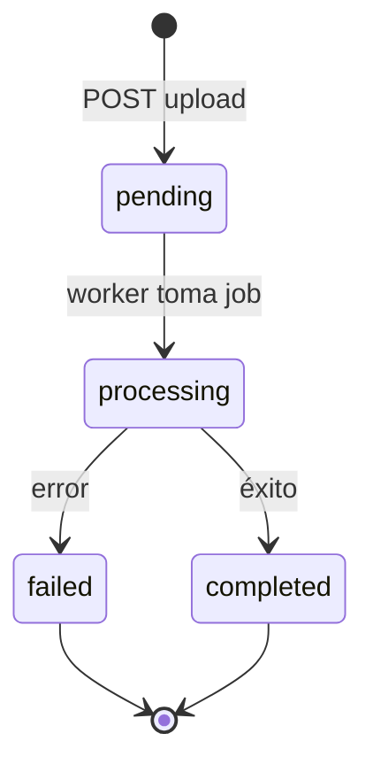

# Spec de salida — Análisis de chats WhatsApp (tono + FAQs)

> **Estado:** implementado en `chat-whatsapp-ai`  
> **Entrada:** [spec-detectar-tono-faq.md](./spec-detectar-tono-faq.md)  
> **Audiencia:** equipo frontend (`chat-whatsapp-ai-ui` u otro portal admin)  
> **Versión:** 1.0 — Junio 2026

---

## 1. Resumen de lo implementado

| Ítem | Estado | Ubicación backend |
|------|--------|-------------------|
| Tablas `ChatImportJob`, `ImportedChatMessage`, `DetectedFaqSuggestion`, `ToneAnalysisResult` | ✅ | `prisma/migrations/20260609_chat_analysis/` |
| Upload `.txt` / `.zip` (máx. 10 MB) | ✅ | `chat-imports.controller.ts` |
| Parser WhatsApp + anonimización | ✅ | `whatsapp-chat-parser.service.ts`, `chat-anonymizer.service.ts` |
| Worker asíncrono BullMQ | ✅ | `chat-import-analysis.worker.ts` |
| Análisis IA de tono y FAQs | ✅ | `chat-analysis-ai.service.ts` |
| Aprobar / editar / rechazar sugerencias FAQ | ✅ | `faq-suggestions.controller.ts` |
| Aprobar tono → actualiza `TenantConfig` | ✅ | `tone-analysis.controller.ts` |
| FAQ aprobada → `TenantFaq` + embedding | ✅ | `faq-detection.service.ts` |
| Listar importaciones históricas | ❌ | *No expuesto aún — ver sección 8* |

**Importante:** `businessId` en la URL = `tenantId` en la base de datos.

---

## 2. Conexión al backend

### Base URL

```
http://localhost:3000        # desarrollo
https://api.tu-dominio.com   # producción
```

### Autenticación

Todas las rutas de este módulo requieren API key interna:

```
X-API-Key: <INTERNAL_API_KEY>
```

Alternativa aceptada:

```
Authorization: Bearer <INTERNAL_API_KEY>
```

### Errores estándar

| HTTP | Body | Cuándo |
|------|------|--------|
| `401` | `{ "error": "Unauthorized" }` | API key inválida |
| `404` | `{ "error": "Business not found" }` | `businessId` inexistente |
| `404` | `{ "error": "Import job not found" }` | Job inexistente o de otro negocio |
| `404` | `{ "error": "FAQ suggestion not found" }` | Sugerencia inexistente |
| `404` | `{ "error": "Tone analysis not found" }` | Análisis aún no generado o inexistente |
| `400` | `{ "error": "mensaje descriptivo" }` | Validación / regla de negocio |
| `201` | objeto JSON | Upload exitoso |

### Convención de nombres en responses

Este módulo responde en **`snake_case`** (distinto de otros endpoints que devuelven camelCase de Prisma). El front puede consumir las respuestas tal cual sin mapeo.

---

## 3. Flujo de usuario (UX)

```txt
[1] Usuario sube chat exportado (.txt o .zip)
         ↓
[2] Backend responde import_job_id + status: pending
         ↓
[3] UI hace polling al job (cada 2–4 s) hasta completed | failed
         ↓
[4] Si completed → cargar en paralelo:
      - GET tone-analysis
      - GET faq-suggestions
      - (opcional) GET messages
         ↓
[5] Usuario revisa tono → Aprobar (con o sin edición)
         ↓
[6] Usuario revisa cada FAQ → Aprobar | Editar | Rechazar
         ↓
[7] FAQs aprobadas aparecen en GET /faqs del negocio
    Tono aprobado actualiza botTone del negocio
```

### Pantallas sugeridas

```
/negocios/:businessId/importar-chat          → wizard de subida
/negocios/:businessId/importar-chat/:jobId     → revisión de resultados
```

O como **tab** dentro del negocio:

```
/negocios/:businessId  → tabs: General | FAQs | Conocimiento | Importar chat
```

---

## 4. Estados y máquinas de estado

### 4.1 Job de importación (`status`)

| Valor API | Significado UI | Acciones sugeridas |
|-----------|----------------|-------------------|
| `pending` | En cola, aún no procesa | Spinner + “Preparando análisis…” |
| `processing` | Parseando y analizando con IA | Spinner + “Analizando conversaciones…” |
| `completed` | Listo para revisar | Mostrar tono + FAQs + métricas |
| `failed` | Error irrecuperable | Mostrar `error_message` + botón “Reintentar subida” |



### 4.2 Sugerencia FAQ (`status`)

| Valor API | Significado UI | Botones visibles |
|-----------|----------------|------------------|
| `pending_review` | Pendiente de revisión | Aprobar, Editar, Rechazar |
| `edited` | Usuario editó, aún no aprueba | Aprobar, Editar, Rechazar |
| `approved` | Ya pasó a FAQ real | Solo lectura / badge “Aprobada” |
| `rejected` | Descartada | Solo lectura / badge “Rechazada” |
| `archived` | Reservado futuro | Ocultar o gris |

### 4.3 Análisis de tono (`status`)

| Valor API | Significado UI | Botones visibles |
|-----------|----------------|------------------|
| `pending_review` | Listo para revisar | Aprobar tono (con editor opcional) |
| `approved` | Ya aplicado al bot | Badge “Aplicado al bot” |
| `rejected` | Reservado futuro | — |

---

## 5. Endpoints — contrato completo

Prefijo de todas las rutas: `/businesses/:businessId`

---

### 5.1 Subir chat exportado

```
POST /businesses/:businessId/chat-imports
Content-Type: multipart/form-data
```

| Campo | Tipo | Requerido | Notas |
|-------|------|-----------|-------|
| `file` | File | Sí | Solo `.txt` o `.zip`. Máx. **10 MB**. No vacío. |
| `business_sender_name` | string | No | Nombre exacto del remitente negocio en el chat (recomendado). Ej: `"Spa Aurora"` |

**Response `201`:**

```json
{
  "import_job_id": "clximport123",
  "status": "pending",
  "message": "Archivo recibido correctamente"
}
```

**Errores frecuentes `400`:**

```json
{ "error": "file is required and must not be empty" }
```

**Ejemplo fetch:**

```typescript
const form = new FormData();
form.append("file", file);
form.append("business_sender_name", "Mi Negocio");

const res = await fetch(`${API_URL}/businesses/${businessId}/chat-imports`, {
  method: "POST",
  headers: { "X-API-Key": apiKey },
  body: form
});
const { import_job_id } = await res.json();
// Guardar import_job_id en URL o estado local para polling
```

> No enviar `Content-Type` manual en multipart; el browser define el boundary.

---

### 5.2 Obtener estado del job (polling)

```
GET /businesses/:businessId/chat-imports/:importJobId
```

**Response `200`:**

```json
{
  "id": "clximport123",
  "status": "completed",
  "total_messages": 240,
  "customer_messages_count": 132,
  "business_messages_count": 108,
  "detected_faq_count": 12,
  "detected_tone_summary": "El negocio responde de forma cercana, breve y amable.",
  "error_message": null,
  "original_filename": "WhatsApp Chat con Cliente.txt",
  "business_sender_name": "Mi Negocio",
  "created_at": "2026-06-09T15:00:00.000Z",
  "started_at": "2026-06-09T15:00:02.000Z",
  "completed_at": "2026-06-09T15:01:30.000Z"
}
```

**Estrategia de polling recomendada:**

```typescript
async function pollImportJob(businessId: string, jobId: string): Promise<ImportJob> {
  const terminal = new Set(["completed", "failed"]);
  while (true) {
    const job = await getImportJob(businessId, jobId);
    if (terminal.has(job.status)) return job;
    await sleep(3000);
  }
}
```

Mostrar progreso aproximado con métricas parciales cuando `status === "processing"` (los contadores pueden seguir en 0 hasta `completed`).

---

### 5.3 Listar mensajes importados (opcional / debug / preview)

```
GET /businesses/:businessId/chat-imports/:importJobId/messages
```

**Query params:**

| Param | Tipo | Default | Valores |
|-------|------|---------|---------|
| `sender_role` | string | — | `customer` \| `business` |
| `is_question` | string | — | `true` (solo preguntas) |
| `limit` | number | `50` | 1–200 |
| `page` | number | `1` | ≥ 1 |

**Response `200`:**

```json
{
  "items": [
    {
      "id": "clxmsg1",
      "message_at": "2026-05-12T10:42:00.000Z",
      "sender_label": "Juan",
      "sender_role": "customer",
      "content": "Hola, cuánto sale?",
      "content_anonymized": "Hola, cuánto sale?",
      "is_question": true,
      "is_business_response": false
    },
    {
      "id": "clxmsg2",
      "message_at": "2026-05-12T10:43:00.000Z",
      "sender_label": "Mi Negocio",
      "sender_role": "business",
      "content": "Hola 😊 El valor es de $15.000",
      "content_anonymized": "Hola 😊 El valor es de $15.000",
      "is_question": false,
      "is_business_response": true
    }
  ],
  "total": 240,
  "page": 1,
  "limit": 50
}
```

**UI sugerida:** vista previa tipo chat con filtros “Solo cliente” / “Solo negocio” / “Solo preguntas”. Usar `content_anonymized` si se muestra en contexto de IA; `content` para revisión humana del negocio.

---

### 5.4 Obtener análisis de tono

```
GET /businesses/:businessId/chat-imports/:importJobId/tone-analysis
```

**Disponible solo cuando el job está `completed`.** Mientras procesa → `404`.

**Response `200`:**

```json
{
  "id": "clxtone1",
  "tone_summary": "El negocio responde de forma cercana, breve y amable. Usa emojis moderados.",
  "communication_style": "cercano, chileno, directo",
  "common_phrases": [
    "Hola 😊",
    "Quedo atento",
    "Puedes agendar por este medio"
  ],
  "emoji_usage": "moderate",
  "response_length": "short",
  "sales_style": "orientado a agendar",
  "formality_level": "semi_formal",
  "recommended_bot_rules": {
    "use_emojis": true,
    "response_length": "short",
    "offer_next_step": true,
    "avoid_long_explanations": true
  },
  "confidence": 0.88,
  "status": "pending_review"
}
```

#### Valores enumerados para UI (labels)

| Campo | Valores posibles | Label sugerido |
|-------|------------------|----------------|
| `emoji_usage` | `none`, `low`, `moderate`, `high` | Sin emojis / Pocos / Moderado / Muchos |
| `response_length` | `short`, `medium`, `long` | Breve / Medio / Largo |
| `formality_level` | `informal`, `semi_formal`, `formal` | Informal / Semi formal / Formal |

---

### 5.5 Aprobar tono detectado

```
PATCH /businesses/:businessId/tone-analysis/:toneAnalysisId/approve
Content-Type: application/json
```

**Body (todo opcional):**

```json
{
  "tone_summary": "Cercano, breve, amable y directo. Usa emojis moderados.",
  "rules": {
    "use_emojis": "moderate",
    "response_length": "short",
    "style": "semi_formal",
    "offer_next_step": true
  }
}
```

Si se omite el body, se aprueba el análisis tal como está.

**Efecto en backend:**

- `ToneAnalysisResult.status` → `approved`
- `TenantConfig.botTone` → `tone_summary` final
- `TenantConfig.configJson.toneRules` → reglas fusionadas

**Response `200`:**

```json
{
  "id": "clxtone1",
  "status": "approved",
  "tone_summary": "Cercano, breve, amable y directo. Usa emojis moderados.",
  "recommended_bot_rules": {
    "use_emojis": "moderate",
    "response_length": "short",
    "offer_next_step": true
  }
}
```

**UI sugerida:**

1. Card con resumen + chips de `common_phrases`
2. Sliders/toggles para `recommended_bot_rules`
3. Textarea editable para `tone_summary` antes de aprobar
4. Botón primario: **“Aplicar tono al bot”**
5. Tras aprobar: toast “Tono actualizado. El bot usará este estilo en nuevas conversaciones.”

---

### 5.6 Listar sugerencias de FAQ

```
GET /businesses/:businessId/chat-imports/:importJobId/faq-suggestions
```

**Response `200`:** array (puede ser vacío `[]`)

```json
[
  {
    "id": "clxfaqsg1",
    "question": "¿Cuánto sale la consulta?",
    "suggested_answer": "Hola 😊 El valor de la consulta es de $____. Puedes agendar por este mismo medio.",
    "category": "precios",
    "evidence_count": 9,
    "confidence": 0.91,
    "status": "pending_review"
  }
]
```

Orden backend: `evidence_count` desc, luego `confidence` desc.

**UI sugerida por fila:**

| Columna | Fuente |
|---------|--------|
| Pregunta | `question` |
| Respuesta sugerida | `suggested_answer` (editable inline) |
| Categoría | `category` (badge) |
| Evidencia | `evidence_count` veces en el chat |
| Confianza | `confidence` como % (ej. 91%) |
| Estado | badge según `status` |
| Acciones | Aprobar / Editar / Rechazar |

Mostrar aviso si la respuesta contiene placeholders (`$____`, `____`): *“Completa los datos faltantes antes de aprobar”*.

---

### 5.7 Editar sugerencia FAQ (sin aprobar aún)

```
PATCH /businesses/:businessId/faq-suggestions/:suggestionId
Content-Type: application/json
```

**Body (al menos un campo):**

```json
{
  "question": "¿Cuál es el valor de la consulta?",
  "suggested_answer": "Hola 😊 La consulta tiene un valor de $15.000.",
  "category": "precios"
}
```

**Response `200`:**

```json
{
  "id": "clxfaqsg1",
  "question": "¿Cuál es el valor de la consulta?",
  "suggested_answer": "Hola 😊 La consulta tiene un valor de $15.000.",
  "category": "precios",
  "status": "edited"
}
```

---

### 5.8 Aprobar sugerencia FAQ

```
PATCH /businesses/:businessId/faq-suggestions/:suggestionId/approve
Content-Type: application/json
```

**Body (opcional — para enviar texto final tras edición en modal):**

```json
{
  "final_question": "¿Cuánto sale la consulta?",
  "final_answer": "Hola 😊 El valor de la consulta es de $15.000. Puedes agendar por este mismo medio."
}
```

Si se omite el body, se usan `question` y `suggested_answer` guardados en la sugerencia.

**Efecto en backend:**

- Sugerencia → `approved`
- Crea registro en `TenantFaq` (tabla FAQs del negocio)
- Indexa embedding para búsqueda semántica

**Response `200`:**

```json
{
  "id": "clxfaqsg1",
  "status": "approved",
  "question": "¿Cuánto sale la consulta?",
  "suggested_answer": "Hola 😊 El valor de la consulta es de $15.000..."
}
```

**Errores `400`:**

```json
{ "error": "question and answer are required" }
{ "error": "A FAQ with the same question already exists" }
```

**UI:** deshabilitar “Aprobar” si `question` o respuesta están vacíos. Tras aprobar, refrescar lista de FAQs (`GET /businesses/:businessId/faqs`).

---

### 5.9 Rechazar sugerencia FAQ

```
PATCH /businesses/:businessId/faq-suggestions/:suggestionId/reject
```

Sin body.

**Response `200`:**

```json
{ "status": "rejected" }
```

---

## 6. Tipos TypeScript para el frontend

```typescript
export type ImportJobStatus = "pending" | "processing" | "completed" | "failed";

export type FaqSuggestionStatus =
  | "pending_review"
  | "edited"
  | "approved"
  | "rejected"
  | "archived";

export type ToneAnalysisStatus = "pending_review" | "approved" | "rejected";

export type SenderRole = "customer" | "business" | "unknown";

export interface ImportJob {
  id: string;
  status: ImportJobStatus;
  total_messages: number;
  customer_messages_count: number;
  business_messages_count: number;
  detected_faq_count: number;
  detected_tone_summary: string | null;
  error_message: string | null;
  original_filename: string;
  business_sender_name: string | null;
  created_at: string;
  started_at: string | null;
  completed_at: string | null;
}

export interface ImportedMessage {
  id: string;
  message_at: string | null;
  sender_label: string | null;
  sender_role: SenderRole;
  content: string | null;
  content_anonymized: string | null;
  is_question: boolean;
  is_business_response: boolean;
}

export interface PaginatedMessages {
  items: ImportedMessage[];
  total: number;
  page: number;
  limit: number;
}

export interface ToneAnalysis {
  id: string;
  tone_summary: string;
  communication_style: string | null;
  common_phrases: string[];
  emoji_usage: string | null;
  response_length: string | null;
  sales_style: string | null;
  formality_level: string | null;
  recommended_bot_rules: Record<string, unknown>;
  confidence: number | null;
  status: ToneAnalysisStatus;
}

export interface FaqSuggestion {
  id: string;
  question: string;
  suggested_answer: string | null;
  category: string | null;
  evidence_count: number;
  confidence: number | null;
  status: FaqSuggestionStatus;
}
```

---

## 7. Integración con módulos existentes del portal

### 7.1 FAQs del negocio (post-aprobación)

Las FAQs aprobadas desde importación aparecen en el listado estándar:

```
GET /businesses/:businessId/faqs
```

Ese endpoint devuelve **camelCase** de Prisma (`tenantId`, `createdAt`, etc.). Ver [spec-ui-knowledge-base.md](./spec-ui-knowledge-base.md) sección 6.

### 7.2 Configuración del bot (post-aprobación de tono)

El tono aprobado se refleja en:

```
GET /businesses/:businessId
```

Campos relevantes en `config`:

```json
{
  "config": {
    "botTone": "Cercano, breve, amable...",
    "configJson": {
      "toneRules": {
        "use_emojis": true,
        "response_length": "short",
        "offer_next_step": true
      },
      "knowledge": { ... }
    }
  }
}
```

El front puede mostrar en **Ajustes del bot** el `botTone` actual y un enlace “Importado desde chat el …” si guardan el `import_job_id` en metadata local.

---

## 8. Limitaciones actuales (importante para el front)

| Limitación | Impacto UI | Workaround |
|------------|------------|------------|
| No hay `GET /chat-imports` (listar jobs) | No se puede mostrar historial de importaciones sin guardar IDs | Persistir `import_job_id` en URL, localStorage o tabla propia del portal |
| `tone-analysis` devuelve `404` hasta que el job termina | No mostrar tab de tono durante processing | Esperar `status === "completed"` antes de llamar |
| `faq-suggestions` vacío si la IA no detectó repetición | Empty state “No se detectaron preguntas frecuentes” | Ofrecer crear FAQ manual en tab FAQs |
| Sin `business_sender_name`, el rol se infiere | Puede haber mensajes `unknown` | Campo obligatorio recomendado en el formulario de subida |
| Procesamiento asíncrono requiere Redis | Job queda en `pending` si el worker no corre | Mostrar mensaje de soporte si lleva >2 min en pending |
| Placeholders en respuestas (`$____`) | FAQ incompleta si se aprueba sin editar | Validar en UI antes de aprobar |

---

## 9. Componentes UI sugeridos

### 9.1 Wizard de subida (paso 1)

- Drag & drop `.txt` / `.zip`
- Input **“Nombre del negocio en el chat”** (`business_sender_name`) con ayuda: *“Debe coincidir con el nombre que aparece antes de los dos puntos en la exportación de WhatsApp”*
- Ejemplo visual del formato esperado:

```txt
12/05/2026, 10:42 - Cliente: Hola, cuánto sale?
12/05/2026, 10:43 - Mi Negocio: Hola 😊 El valor es de $15.000
```

### 9.2 Pantalla de procesamiento (paso 2)

- Barra de progreso indeterminada
- Texto según `status`: pending / processing
- Métricas del job cuando estén disponibles

### 9.3 Panel de revisión (paso 3)

Layout en dos columnas o tabs:

| Tab | Contenido |
|-----|-----------|
| **Tono** | Resumen, frases comunes, reglas, botón “Aplicar al bot” |
| **FAQs** | Tabla de sugerencias con acciones masivas opcionales |
| **Vista previa** | Mensajes paginados (opcional) |

### 9.4 Acciones masivas (opcional v2)

- “Aprobar todas las FAQs con confianza ≥ 90%”
- “Rechazar todas las de categoría X”

No soportado por API hoy; requeriría llamadas individuales o nuevo endpoint batch.

---

## 10. Formato del archivo WhatsApp (validación en UI)

Antes de subir, el front puede hacer validación ligera en cliente:

- Extensión `.txt` o `.zip`
- Tamaño ≤ 10 MB
- Para `.txt`: al menos una línea que coincida con patrón `DD/MM/YYYY, HH:MM - Nombre: mensaje`

Regex orientativa (no bloqueante):

```typescript
const WHATSAPP_LINE =
  /^\[?\d{1,2}\/\d{1,2}\/\d{2,4},?\s+\d{1,2}:\d{2}/;
```

Si no hay coincidencias, warning: *“El archivo podría no ser una exportación válida de WhatsApp”*.

---

## 11. Checklist de implementación frontend

- [ ] Formulario multipart con `file` + `business_sender_name`
- [ ] Guardar `import_job_id` tras upload (URL query `?job=` o ruta dedicada)
- [ ] Polling hasta `completed` / `failed`
- [ ] Manejo de `error_message` en estado failed
- [ ] Cargar tono + FAQs solo cuando `completed`
- [ ] Editor de tono con approve
- [ ] Tabla FAQs con edit / approve / reject
- [ ] Validar placeholders antes de aprobar FAQ
- [ ] Toast + refresh de `GET /faqs` tras aprobar
- [ ] Empty states para 0 FAQs detectadas
- [ ] (Opcional) Vista previa de mensajes paginada

---

## 12. Referencia rápida de rutas

| Método | Ruta |
|--------|------|
| `POST` | `/businesses/:businessId/chat-imports` |
| `GET` | `/businesses/:businessId/chat-imports/:importJobId` |
| `GET` | `/businesses/:businessId/chat-imports/:importJobId/messages` |
| `GET` | `/businesses/:businessId/chat-imports/:importJobId/faq-suggestions` |
| `GET` | `/businesses/:businessId/chat-imports/:importJobId/tone-analysis` |
| `PATCH` | `/businesses/:businessId/faq-suggestions/:suggestionId` |
| `PATCH` | `/businesses/:businessId/faq-suggestions/:suggestionId/approve` |
| `PATCH` | `/businesses/:businessId/faq-suggestions/:suggestionId/reject` |
| `PATCH` | `/businesses/:businessId/tone-analysis/:toneAnalysisId/approve` |

---

## 13. Próximos endpoints sugeridos (no implementados)

Si el portal necesita historial, pedir al backend:

```
GET /businesses/:businessId/chat-imports?page=1&limit=20
```

Con el mismo shape de `ImportJob` en cada ítem del array.
