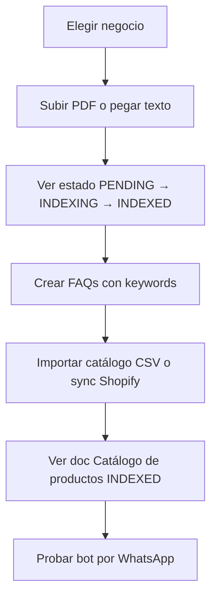

# Spec UI — Base de conocimiento, catálogo y FAQs

> **Audiencia:** equipo frontend (`chat-whatsapp-ai-ui` u otro portal admin)  
> **Backend:** `chat-whatsapp-ai` — API REST interna  
> **Versión:** 1.0 — Junio 2026  
> **Alcance:** pantallas para gestionar KB, FAQs flexibles, catálogo (CSV/JSON/Shopify) y configuración por negocio

---

## 1. Resumen

El portal admin debe permitir que cada **negocio** (tenant) configure lo que el bot de WhatsApp sabe responder:

| Módulo UI | Qué hace | APIs principales |
|-----------|----------|------------------|
| **Documentos KB** | Subir PDF/DOCX/TXT o pegar texto; ver estado de indexación | `knowledge-documents` |
| **FAQs** | Preguntas/respuestas con sinónimos y keywords | `faqs` |
| **Catálogo** | Productos desde CSV, JSON o sync Shopify | `catalog`, `integrations/shopify` |
| **Ajustes KB** | Umbrales RAG/FAQ, chunking, auto-index | `settings` |

**Importante:** `businessId` en la URL = `tenantId` en la base de datos.

---

## 2. Conexión al backend

### Base URL

```
http://localhost:3000        # desarrollo
https://api.tu-dominio.com     # producción
```

### Autenticación (todas las rutas excepto `/health` y webhooks)

Header obligatorio en **cada** request:

```
X-API-Key: <INTERNAL_API_KEY>
```

Alternativa aceptada:

```
Authorization: Bearer <INTERNAL_API_KEY>
```

### Errores estándar

| HTTP | Body | Cuándo |
|------|------|--------|
| `401` | `{ "error": "Unauthorized" }` | API key inválida |
| `404` | `{ "error": "Business not found" }` | `businessId` inexistente |
| `403` | `{ "error": "Document does not belong to this business" }` | Recurso de otro tenant |
| `400` | `{ "error": "mensaje descriptivo" }` | Validación Zod / lógica de negocio |
| `204` | *(vacío)* | DELETE exitoso |

### Convención de nombres

- **Request body:** `snake_case` (ej. `alternate_phrases`, `raw_text`)
- **Response Prisma:** mayormente `camelCase` (ej. `tenantId`, `createdAt`, `alternatePhrases`)
- El front debe normalizar o mapear según su convención interna

### Health check (sin API key)

```
GET /health
→ 200 { "ok": true, "db": "up" }
→ 503 { "ok": false, "db": "down" }
```

---

## 3. Mapa de pantallas sugerido

```
/negocios                          → lista de businesses
/negocios/:businessId              → dashboard del negocio
/negocios/:businessId/conocimiento  → tab Documentos KB
/negocios/:businessId/faqs          → tab FAQs
/negocios/:businessId/catalogo      → tab Catálogo + integraciones
/negocios/:businessId/ajustes       → bot + knowledge settings
```

### Flujo usuario típico (happy path)



---

## 4. Negocios (contexto multi-tenant)

### Listar negocios

```
GET /businesses
```

**Response `200`:**

```json
[
  {
    "id": "clx...",
    "name": "Panadería Sol",
    "slug": "panaderia-sol",
    "status": "ACTIVE",
    "bot_global_enabled": true,
    "default_ai_model": "gpt-4o-mini",
    "confidence_threshold": 0.7,
    "timezone": "America/Santiago",
    "created_at": "2026-06-01T00:00:00.000Z",
    "updated_at": "2026-06-09T00:00:00.000Z"
  }
]
```

### Detalle de negocio

```
GET /businesses/:id
```

Incluye `config`, `whatsapp_accounts`, `agents`. Usar `id` como `businessId` en el resto de rutas.

### Crear negocio (solo admin plataforma)

```
POST /businesses
Content-Type: application/json

{
  "name": "Panadería Sol",
  "slug": "panaderia-sol",
  "businessType": "retail",
  "timezone": "America/Santiago",
  "botName": "Sole",
  "botTone": "cálido y cercano"
}
```

---

## 5. Módulo: Documentos de conocimiento

### 5.1 Listar documentos

```
GET /businesses/:businessId/knowledge-documents
```

**Response `200`:** array de documentos (orden: más reciente primero).

```json
[
  {
    "id": "clxdoc...",
    "tenantId": "clxbiz...",
    "title": "Menú PDF",
    "sourceType": "PDF",
    "fileUrl": null,
    "storagePath": "tenants/clxbiz.../documents/clxdoc....pdf",
    "mimeType": "application/pdf",
    "fileSize": 245000,
    "rawText": null,
    "status": "INDEXED",
    "indexError": null,
    "indexedAt": "2026-06-09T12:00:00.000Z",
    "createdAt": "2026-06-09T11:59:00.000Z",
    "updatedAt": "2026-06-09T12:00:00.000Z"
  }
]
```

### 5.2 Estados del documento (UI)

| `status` | Badge sugerido | Acción UI |
|----------|----------------|-----------|
| `PENDING` | Gris — “En cola” | Mostrar spinner; iniciar polling |
| `INDEXING` | Amarillo — “Indexando…” | Polling cada 2–3 s |
| `INDEXED` | Verde — “Listo” | Mostrar `indexedAt` |
| `ERROR` | Rojo — “Error” | Mostrar `indexError`; botón “Reintentar” |

**Polling recomendado:** tras crear o subir documento, hacer `GET /knowledge-documents` cada 2 s hasta `INDEXED` o `ERROR` (timeout UI: 2 min).

### 5.3 Crear documento con texto manual

```
POST /businesses/:businessId/knowledge-documents
Content-Type: application/json

{
  "title": "Política de devoluciones",
  "source_type": "MANUAL",
  "raw_text": "Aceptamos devoluciones dentro de 7 días...",
  "auto_index": true
}
```

- Si `auto_index` se omite, usa la config del tenant (`autoIndexOnCreate`, default `true`).
- Solo se encola indexación si hay `raw_text` o `file_url` con contenido.

**Response `201`:** objeto documento con `status: "PENDING"`.

### 5.4 Subir archivo (PDF, DOCX, TXT)

```
POST /businesses/:businessId/knowledge-documents/upload
Content-Type: multipart/form-data
```

| Campo | Tipo | Requerido | Notas |
|-------|------|-----------|-------|
| `file` | File | Sí | Máx. **15 MB** |
| `title` | string | No | Default: nombre del archivo |

**Tipos soportados:** PDF, DOCX, TXT (por MIME).

**Response `201`:** documento con `storagePath`, `mimeType`, `fileSize`, `status: "PENDING"`. La indexación se encola automáticamente.

**Ejemplo fetch (frontend):**

```typescript
const form = new FormData();
form.append("file", file);
form.append("title", "Menú 2026");

await fetch(`${API_URL}/businesses/${businessId}/knowledge-documents/upload`, {
  method: "POST",
  headers: { "X-API-Key": apiKey },
  body: form
});
```

> No enviar `Content-Type: application/json` en upload; el browser setea el boundary del multipart.

### 5.5 Re-indexar manualmente

```
POST /businesses/:businessId/knowledge-documents/:id/index
```

**Response `200`:**

```json
{
  "id": "clxdoc...",
  "status": "PENDING",
  "queued": true,
  ...
}
```

### 5.6 Eliminar documento

```
DELETE /businesses/:businessId/knowledge-documents/:id
```

**Response `204`**. Borra chunks, metadata y archivo en storage si existe.

### 5.7 UI — componentes sugeridos

1. **Tabla de documentos:** título, tipo, tamaño, estado, fecha indexación, acciones (reindexar, eliminar).
2. **Zona drag & drop** para PDF/DOCX/TXT.
3. **Modal “Texto manual”** con textarea + título.
4. **Toast** al encolar: “Documento en cola de indexación”.
5. **Empty state:** “Sube tu primer documento para que el bot pueda responder con información de tu negocio”.

---

## 6. Módulo: FAQs flexibles

El bot matchea FAQs en 3 capas: exacto → keywords/sinónimos → semántico (embedding). Para preguntas informales como *“a cuanto las hallullas”* el front debe permitir configurar **keywords** y **frases alternativas**.

### 6.1 Listar FAQs

```
GET /businesses/:businessId/faqs
```

**Response `200`:**

```json
[
  {
    "id": "clxfaq...",
    "tenantId": "clxbiz...",
    "question": "¿Cuánto cuestan las hallullas?",
    "answer": "Las hallullas artesanales cuestan $1.800 las 6 unidades.",
    "category": "precios",
    "priority": 10,
    "alternatePhrases": ["precio de las hallullas", "cuanto sale la hallulla"],
    "keywords": ["hallulla", "hallullas", "pan amasado"],
    "searchText": "¿Cuánto cuestan las hallullas?\nprecio de las hallullas\n...",
    "isActive": true,
    "createdAt": "...",
    "updatedAt": "..."
  }
]
```

### 6.2 Crear FAQ

```
POST /businesses/:businessId/faqs
Content-Type: application/json

{
  "question": "¿Cuánto cuestan las hallullas?",
  "answer": "Las hallullas artesanales cuestan $1.800 las 6 unidades.",
  "category": "precios",
  "priority": 10,
  "active": true,
  "alternate_phrases": [
    "precio de las hallullas",
    "cuanto sale la hallulla",
    "a cuanto las hallullas"
  ],
  "keywords": ["hallulla", "hallullas", "pan amasado"]
}
```

- `alternate_phrases` y `keywords` son opcionales (default `[]`).
- El backend genera `searchText` y re-indexa el embedding automáticamente.

### 6.3 Editar FAQ

```
PATCH /businesses/:businessId/faqs/:id
```

Body parcial (mismos campos que create). Requiere `businessId` en la URL (validación de ownership).

### 6.4 Eliminar FAQ

```
DELETE /businesses/:businessId/faqs/:id
```

**Response `204`**.

### 6.5 UI — campos y ayudas

| Campo UI | API | Ayuda al usuario |
|----------|-----|------------------|
| Pregunta oficial | `question` | Como la pondrías en una web |
| Respuesta | `answer` | Texto exacto que envía el bot |
| Categoría | `category` | Opcional, para filtrar en tabla |
| Prioridad | `priority` | Mayor número = se evalúa antes |
| Frases alternativas | `alternate_phrases` | Chips/tags: “como lo diría un cliente” |
| Palabras clave | `keywords` | Productos, nombres propios, jerga |
| Activa | `active` | Toggle on/off |

**Tip UX:** debajo de keywords, texto de ayuda:

> *“Agrega cómo tus clientes preguntan en WhatsApp. Ej: ‘a cuanto las hallullas’, ‘precio hallulla’.”*

### 6.6 Panel de prueba (recomendado en UI)

Mini simulador local (no hay endpoint de preview aún):

1. Mostrar las FAQs activas ordenadas por prioridad.
2. Input “Escribe como un cliente” + botón “¿Matchearía?”
3. Lógica opcional en front: normalizar y comparar keywords (solo preview visual).

Para prueba real: enviar mensaje por WhatsApp al número del negocio.

---

## 7. Módulo: Catálogo de productos

Los productos se guardan en `TenantCatalogProduct`. Al importar o sincronizar, el backend:

1. Upsert de productos.
2. Genera/actualiza documento **“Catálogo de productos”**.
3. Encola indexación RAG automática.

### 7.1 Listar productos

```
GET /businesses/:businessId/catalog/products
```

**Response `200`:**

```json
[
  {
    "id": "clxprod...",
    "tenantId": "clxbiz...",
    "externalId": "12345",
    "sku": "HAL-6",
    "name": "Hallulla x6",
    "description": "Pan fresco del día",
    "price": 1800,
    "currency": "CLP",
    "category": "Panes",
    "tags": ["pan", "hallulla"],
    "metadata": {},
    "source": "CSV",
    "isActive": true,
    "createdAt": "...",
    "updatedAt": "..."
  }
]
```

`source`: `MANUAL` | `CSV` | `JSON` | `SHOPIFY`

### 7.2 Importar CSV

```
POST /businesses/:businessId/catalog/import/csv
Content-Type: application/json

{
  "csv_text": "nombre,precio,descripcion,sku,categoria\nHallulla x6,1800,Pan fresco del día,HAL-6,Panes\nTorta tres leches,3500,Porción individual,TTL-1,Tortas"
}
```

También acepta campo `csv` en lugar de `csv_text`.

**Columnas reconocidas (flexible, español/inglés):**

| Concepto | Headers aceptados |
|----------|-------------------|
| Nombre | `name`, `nombre`, `producto`, `title`, `titulo` |
| Precio | `price`, `precio`, `valor` |
| Descripción | `description`, `descripcion`, `detalle` |
| SKU | `sku`, `codigo`, `code` |
| Categoría | `category`, `categoria`, `rubro` |
| Tags | `tags`, `etiquetas` (separadas por `;`) |

**Response `201`:**

```json
{
  "products_imported": 2,
  "documentId": "clxdoc..."
}
```

### 7.3 Importar JSON

```
POST /businesses/:businessId/catalog/import/json
Content-Type: application/json
```

**Formato A — array directo:**

```json
[
  {
    "name": "Hallulla x6",
    "price": 1800,
    "description": "Pan fresco del día",
    "sku": "HAL-6",
    "category": "Panes",
    "tags": ["pan", "hallulla"]
  }
]
```

**Formato B — wrapper:**

```json
{
  "products": [ { "nombre": "...", "precio": 1800 } ]
}
```

También acepta claves en español: `nombre`, `precio`, `descripcion`, `categoria`.

**Response `201`:** igual que CSV.

### 7.4 Shopify — conectar

```
POST /businesses/:businessId/integrations/shopify
Content-Type: application/json

{
  "shop_domain": "mi-tienda.myshopify.com",
  "access_token": "shpat_xxxxxxxx"
}
```

- El token se guarda **cifrado** en backend; nunca se devuelve en GET.
- `shop_domain` sin `https://`.

**Response `201`:**

```json
{ "connected": true, "provider": "SHOPIFY" }
```

### 7.5 Shopify — estado de integración

```
GET /businesses/:businessId/integrations/shopify
```

**Conectado:**

```json
{
  "id": "clxint...",
  "provider": "SHOPIFY",
  "shopDomain": "mi-tienda.myshopify.com",
  "lastSyncAt": "2026-06-09T10:00:00.000Z",
  "isActive": true,
  "createdAt": "...",
  "updatedAt": "..."
}
```

**No conectado:**

```json
{ "connected": false }
```

### 7.6 Shopify — sincronizar catálogo

```
POST /businesses/:businessId/integrations/shopify/sync
```

**Response `200`:**

```json
{
  "products_synced": 42,
  "documentId": "clxdoc..."
}
```

Errores comunes `400`: token inválido, tienda no configurada, API Shopify rechazada.

### 7.7 UI — catálogo

1. **Tabla de productos** con búsqueda por nombre/SKU/categoría.
2. **Import CSV:** textarea o upload `.csv` → leer como texto → `POST import/csv`.
3. **Import JSON:** textarea con validación JSON o upload `.json`.
4. **Card Shopify:** dominio + token + botón “Conectar” + “Sincronizar ahora” + `lastSyncAt`.
5. **Link cruzado:** tras import/sync, mostrar enlace al documento “Catálogo de productos” en tab KB.

---

## 8. Ajustes del bot y KB

```
PATCH /businesses/:id/settings
Content-Type: application/json
```

### Campos generales

```json
{
  "bot_global_enabled": true,
  "confidence_threshold": 0.7,
  "default_ai_model": "gpt-4o-mini"
}
```

### Bloque knowledge (por tenant)

```json
{
  "knowledge": {
    "enabled": true,
    "top_k": 5,
    "chunk_size": 500,
    "chunk_overlap": 50,
    "min_confidence": 0.7,
    "faq_similarity_threshold": 0.78,
    "auto_index_on_create": true
  }
}
```

**Response `200`:**

```json
{
  "id": "clxbiz...",
  "bot_global_enabled": true,
  "confidence_threshold": 0.7,
  "default_ai_model": "gpt-4o-mini",
  "knowledge": {
    "enabled": true,
    "topK": 5,
    "chunkSize": 500,
    "chunkOverlap": 50,
    "minConfidence": 0.7,
    "faqSimilarityThreshold": 0.78,
    "autoIndexOnCreate": true
  }
}
```

> El response de `knowledge` usa **camelCase** (parseado por backend).

### UI — sliders sugeridos

| Campo | Rango | Descripción corta |
|-------|-------|---------------------|
| `confidence_threshold` / `min_confidence` | 0–1 | Qué tan seguro debe estar el RAG antes de responder con IA |
| `faq_similarity_threshold` | 0–1 | Qué tan parecida debe ser la pregunta del cliente a una FAQ (bajar = más flexible) |
| `top_k` | 1–20 | Fragmentos de contexto que recibe la IA |
| `chunk_size` | 100–2000 | Tamaño de fragmentos al indexar (afecta re-index futuro) |

---

## 9. Cómo probar end-to-end desde la UI

### Checklist QA

- [ ] `GET /health` responde `ok: true`
- [ ] Listar negocios y seleccionar uno
- [ ] Subir PDF → ver `PENDING` → `INDEXING` → `INDEXED`
- [ ] Crear FAQ con `keywords` → probar por WhatsApp pregunta informal
- [ ] Importar CSV de 2 productos → ver productos en tabla
- [ ] Ver documento “Catálogo de productos” en KB con estado `INDEXED`
- [ ] Preguntar por WhatsApp precio de un producto del catálogo
- [ ] Conectar Shopify (tienda de prueba) → sync → productos visibles
- [ ] Eliminar documento KB → desaparece de lista
- [ ] Intentar acceder FAQ de otro `businessId` → `403`

### Datos de prueba — FAQ hallullas

```json
{
  "question": "¿Cuánto cuestan las hallullas?",
  "answer": "Las hallullas artesanales cuestan $1.800 las 6 unidades.",
  "alternate_phrases": ["a cuanto las hallullas", "precio hallulla", "cuanto sale la hallulla"],
  "keywords": ["hallulla", "hallullas"],
  "priority": 10
}
```

**Mensajes WhatsApp a probar:**

- `a cuanto las hallullas`
- `oye y la hallulla cuanto sale`
- `precio de las hallullas por favor`

### Datos de prueba — CSV mínimo

```csv
nombre,precio,descripcion
Hallulla x6,1800,Pan fresco del día
Torta tres leches,3500,Porción individual
```

---

## 10. Cliente API TypeScript (referencia)

```typescript
const API_URL = import.meta.env.VITE_BOT_API_URL ?? "http://localhost:3000";
const API_KEY = import.meta.env.VITE_BOT_API_KEY!;

async function api<T>(path: string, init: RequestInit = {}): Promise<T> {
  const headers = new Headers(init.headers);
  headers.set("X-API-Key", API_KEY);
  if (init.body && !(init.body instanceof FormData)) {
    headers.set("Content-Type", "application/json");
  }

  const res = await fetch(`${API_URL}${path}`, { ...init, headers });
  if (res.status === 204) return undefined as T;
  const data = await res.json();
  if (!res.ok) throw new Error(data.error ?? res.statusText);
  return data as T;
}

// Ejemplos
export const listDocuments = (businessId: string) =>
  api<KnowledgeDocument[]>(`/businesses/${businessId}/knowledge-documents`);

export const uploadDocument = (businessId: string, file: File, title?: string) => {
  const form = new FormData();
  form.append("file", file);
  if (title) form.append("title", title);
  return api<KnowledgeDocument>(`/businesses/${businessId}/knowledge-documents/upload`, {
    method: "POST",
    body: form
  });
};

export const createFaq = (businessId: string, body: CreateFaqBody) =>
  api<Faq>(`/businesses/${businessId}/faqs`, {
    method: "POST",
    body: JSON.stringify(body)
  });

export const importCatalogCsv = (businessId: string, csvText: string) =>
  api<ImportResult>(`/businesses/${businessId}/catalog/import/csv`, {
    method: "POST",
    body: JSON.stringify({ csv_text: csvText })
  });
```

### Variables de entorno sugeridas en el front

```env
VITE_BOT_API_URL=http://localhost:3000
VITE_BOT_API_KEY=replace_me_internal_api_key
```

---

## 11. Tipos TypeScript para el front

```typescript
type KnowledgeDocumentStatus = "PENDING" | "INDEXING" | "INDEXED" | "ERROR";

interface KnowledgeDocument {
  id: string;
  tenantId: string;
  title: string;
  sourceType: "PDF" | "DOCX" | "TXT" | "MANUAL" | "URL";
  fileUrl: string | null;
  storagePath: string | null;
  mimeType: string | null;
  fileSize: number | null;
  rawText: string | null;
  status: KnowledgeDocumentStatus;
  indexError: string | null;
  indexedAt: string | null;
  createdAt: string;
  updatedAt: string;
}

interface Faq {
  id: string;
  tenantId: string;
  question: string;
  answer: string;
  category: string | null;
  priority: number;
  alternatePhrases: string[];
  keywords: string[];
  searchText: string | null;
  isActive: boolean;
  createdAt: string;
  updatedAt: string;
}

interface CatalogProduct {
  id: string;
  tenantId: string;
  externalId: string | null;
  sku: string | null;
  name: string;
  description: string | null;
  price: number | null;
  currency: string;
  category: string | null;
  tags: string[];
  source: "MANUAL" | "CSV" | "JSON" | "SHOPIFY";
  isActive: boolean;
}

interface KnowledgeSettings {
  enabled: boolean;
  topK: number;
  chunkSize: number;
  chunkOverlap: number;
  minConfidence?: number;
  faqSimilarityThreshold?: number;
  autoIndexOnCreate: boolean;
}

interface CreateFaqBody {
  question: string;
  answer: string;
  category?: string;
  priority?: number;
  active?: boolean;
  alternate_phrases?: string[];
  keywords?: string[];
}

interface ImportResult {
  products_imported?: number;
  products_synced?: number;
  documentId: string;
}
```

---

## 12. Limitaciones actuales (documentar en UI)

| Limitación | Impacto en UI |
|------------|---------------|
| No hay endpoint de descarga del PDF original | Mostrar solo metadata (`fileSize`, `mimeType`), no link de descarga |
| `file_url` en create JSON no se descarga automáticamente | Ocultar o marcar como “próximamente” |
| Indexación es async (cola Redis) | Siempre usar polling de estado, no asumir `INDEXED` inmediato |
| Una sola API key global | No hay login por negocio; el front elige `businessId` en sesión admin |
| Shopify requiere token Admin API manual | Formulario de token, no OAuth flow aún |
| Re-index por cambio de `chunk_size` | Avisar: “Los cambios de chunk aplican a nuevas indexaciones; re-indexa documentos existentes” |

---

## 13. Rutas completas (referencia rápida)

```
GET    /health
GET    /businesses
POST   /businesses
GET    /businesses/:id
PATCH  /businesses/:id/settings

GET    /businesses/:businessId/knowledge-documents
POST   /businesses/:businessId/knowledge-documents
POST   /businesses/:businessId/knowledge-documents/upload
POST   /businesses/:businessId/knowledge-documents/:id/index
DELETE /businesses/:businessId/knowledge-documents/:id

GET    /businesses/:businessId/faqs
POST   /businesses/:businessId/faqs
PATCH  /businesses/:businessId/faqs/:id
DELETE /businesses/:businessId/faqs/:id

GET    /businesses/:businessId/catalog/products
POST   /businesses/:businessId/catalog/import/csv
POST   /businesses/:businessId/catalog/import/json
POST   /businesses/:businessId/integrations/shopify
GET    /businesses/:businessId/integrations/shopify
POST   /businesses/:businessId/integrations/shopify/sync
```

---

## 14. Contacto / dependencias

- **Backend repo:** `chat-whatsapp-ai`
- **Requiere en dev:** PostgreSQL + Redis + `npm run dev` (workers de mensajes y KB)
- **Migración:** `20260609_knowledge_catalog_faq`

Si el UI usa Supabase para conversaciones, seguir usando Supabase para el inbox; **esta API es solo para administración de conocimiento**, no para el feed de chat en tiempo real.
